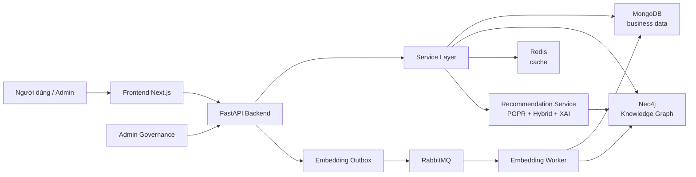
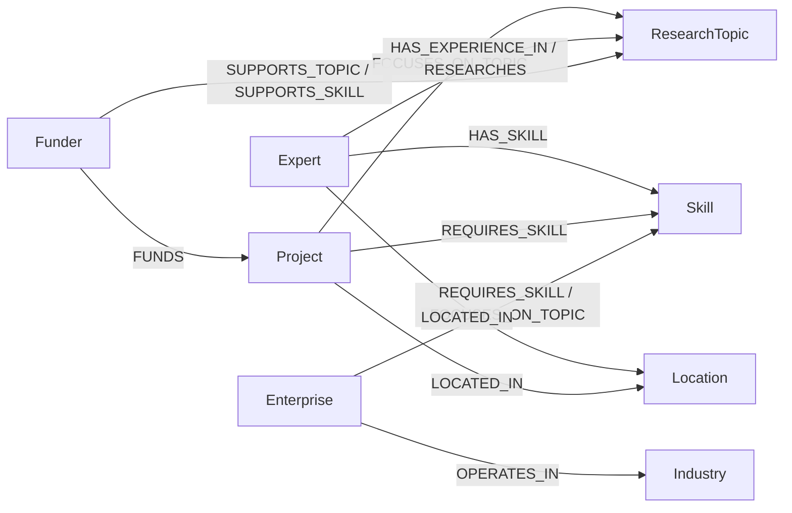
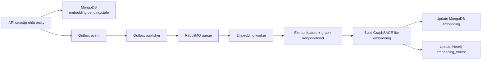

# ABSTRACT

This thesis develops a hybrid recommendation system for the research and development ecosystem, where experts, research projects, enterprises, and funding organizations need to be connected based on profile data and multi-hop relationships. The system stores business data in MongoDB and represents domain knowledge as a Knowledge Graph in Neo4j. Policy-Guided Path Reasoning (PGPR) is used to exploit reasoning paths for explainable recommendation (1), while a hybrid ranking layer combines PGPR evidence, graph paths, embedding similarity, and topic/skill overlap.

To address the cold-start problem when new users, projects, or entities are added, the thesis introduces GraphSAGE-lite, a lightweight inductive embedding mechanism inspired by GraphSAGE (2). Unlike the original deep GraphSAGE model, GraphSAGE-lite in this thesis deterministically aggregates textual features and graph-neighborhood signals into a 128-dimensional normalized vector. Embedding generation is processed asynchronously using RabbitMQ, the transactional outbox pattern, and worker services to improve reliability (8)(9).

The implemented system includes user authentication, profile and project management, recommendation APIs, explainable recommendation, graph exploration, evaluation reports, admin governance, Docker-based deployment, and security hardening. For detailed explanation, the system integrates a local LLM layer using Ollama with the `llama3` model to verbalize reasoning-path evidence and scoring metadata without changing ranking results. Offline evaluation on 22 admin-reviewed queries shows that the hybrid method achieves Recall@5 = 0.6515 and explanation coverage = 0.8000, while maintaining NDCG@5 = 0.5355 and MRR = 0.5871. Although embedding-only slightly outperforms hybrid in NDCG@5 on the small seed dataset, it does not provide reasoning-path explanations. Therefore, the hybrid method is more suitable for the thesis objective of producing both relevant and explainable recommendations.

The thesis also implements an Inductive PGPR prototype in shadow-debug mode as a future research direction. Due to the limited dataset size, this prototype is not promoted to production. Overall, the work demonstrates the feasibility of combining Knowledge Graphs, PGPR, inductive embeddings, and XAI for recommending research collaboration opportunities.

**Keywords:** Knowledge Graph; PGPR; GraphSAGE; hybrid recommendation system; cold-start; XAI.

# MỤC LỤC

Nội dung mục lục sẽ được cập nhật tự động trong bản DOCX sau khi hoàn thiện số trang.

# DANH MỤC HÌNH ẢNH

Hình 3.1: Kiến trúc tổng thể hệ thống gợi ý R&D.

Hình 3.2: Luồng xử lý recommendation theo mô hình lai.

Hình 3.3: Luồng xử lý embedding bất đồng bộ bằng RabbitMQ, outbox và worker.

Hình 3.4: Sơ đồ quan hệ tri thức rút gọn trong Knowledge Graph.

Hình 4.1: Giao diện dashboard gợi ý.

Hình 4.2: Giao diện giải thích reasoning path.

Hình 4.3: Giao diện quản trị, kiểm duyệt và giám sát embedding pipeline.

# DANH MỤC BẢNG BIỂU

Bảng 2.1: Tổng hợp các công nghệ sử dụng trong hệ thống.

Bảng 3.1: Các nhóm yêu cầu chức năng.

Bảng 3.2: Các nhóm thực thể chính trong hệ thống.

Bảng 3.3: Thành phần điểm trong mô hình gợi ý lai.

Bảng 3.4: Schema dữ liệu nghiệp vụ rút gọn.

Bảng 4.1: Thống kê dữ liệu seed.

Bảng 4.2: Thống kê node và relationship trong Knowledge Graph.

Bảng 4.3: Kết quả đánh giá offline theo các phương pháp xếp hạng.

Bảng 4.4: Phân bố query đánh giá và relevant item.

Bảng 4.5: Phân tích failure cases.

Bảng 4.6: Các nhóm kiểm thử chính.

# DANH MỤC TỪ VIẾT TẮT

| Từ viết tắt | Giải thích |
| --- | --- |
| AI | Artificial Intelligence - Trí tuệ nhân tạo |
| API | Application Programming Interface - Giao diện lập trình ứng dụng |
| DB | Database - Cơ sở dữ liệu |
| GNN | Graph Neural Network - Mạng nơ-ron trên đồ thị |
| KG | Knowledge Graph - Đồ thị tri thức |
| LLM | Large Language Model - Mô hình ngôn ngữ lớn |
| MRR | Mean Reciprocal Rank |
| NDCG | Normalized Discounted Cumulative Gain |
| PGPR | Policy-Guided Path Reasoning |
| R&D | Research and Development - Nghiên cứu và phát triển |
| XAI | Explainable Artificial Intelligence - Trí tuệ nhân tạo có khả năng giải thích |

# CHƯƠNG 1: GIỚI THIỆU

## 1.1. Đặt vấn đề

Trong hệ sinh thái nghiên cứu và đổi mới sáng tạo, việc kết nối đúng chuyên gia, dự án, doanh nghiệp và quỹ tài trợ là một nhu cầu quan trọng. Một dự án nghiên cứu có thể cần chuyên gia phù hợp về chuyên môn, doanh nghiệp phù hợp để thử nghiệm hoặc thương mại hóa, và nguồn tài trợ phù hợp với lĩnh vực ứng dụng. Ngược lại, chuyên gia cũng cần được gợi ý các dự án, doanh nghiệp hoặc quỹ tài trợ có khả năng tạo ra hợp tác thực tế. Nếu quá trình này chỉ dựa vào tìm kiếm thủ công, mạng lưới cá nhân hoặc dữ liệu rời rạc, hệ thống khó mở rộng, khó kiểm soát chất lượng và khó giải thích lý do vì sao một kết nối được đề xuất.

Bài toán gợi ý trong bối cảnh R&D có đặc thù khác với gợi ý sản phẩm thông thường. Dữ liệu không chỉ gồm tên, mô tả hoặc từ khóa, mà còn gồm quan hệ nhiều bước giữa các thực thể: chuyên gia có kỹ năng nào, dự án tập trung vào chủ đề nào, doanh nghiệp cần công nghệ gì, quỹ tài trợ ưu tiên ngành/lĩnh vực nào, và các thực thể có liên kết địa lý hoặc hợp tác trước đó ra sao. Do đó, Knowledge Graph là một lựa chọn phù hợp vì biểu diễn được thực thể, thuộc tính và quan hệ dưới dạng cấu trúc đồ thị, hỗ trợ suy luận theo đường đi và khai thác tri thức liên kết (3)(5).

Bên cạnh đó, hệ thống gợi ý cần có khả năng giải thích. Trong môi trường nghiên cứu, người dùng không chỉ cần danh sách kết quả mà còn cần biết vì sao một chuyên gia hoặc một đối tác được đề xuất. Các phương pháp dựa trên đường đi trong Knowledge Graph có ưu điểm là có thể trả về chuỗi quan hệ làm bằng chứng, ví dụ: dự án yêu cầu kỹ năng PyTorch, chuyên gia có kỹ năng PyTorch, hoặc dự án và chuyên gia cùng tập trung vào một chủ đề nghiên cứu. PGPR là một hướng tiếp cận phù hợp vì mô hình hóa recommendation như quá trình đi từng bước trên Knowledge Graph và tạo ra reasoning path phục vụ giải thích (1).

Tuy nhiên, hệ thống còn gặp thách thức cold-start. Khi người dùng, dự án hoặc thực thể mới được thêm vào, thực thể đó có thể chưa xuất hiện trong vocab hoặc embedding đã huấn luyện của PGPR cổ điển. Nếu chỉ dựa vào embedding cố định hoặc policy đã train trên graph cũ, hệ thống khó tạo gợi ý tốt cho node mới. Vì vậy, đồ án bổ sung cơ chế GraphSAGE-lite nhằm tạo embedding dựa trên đặc trưng hồ sơ và ngữ cảnh lân cận của node. Ý tưởng này dựa trên hướng học biểu diễn quy nạp, trong đó mô hình có thể sinh embedding cho node mới bằng cách tổng hợp thông tin feature và neighborhood (2).

Từ những vấn đề trên, đồ án xây dựng một hệ thống gợi ý lai cho hệ sinh thái R&D, kết hợp Knowledge Graph, PGPR, embedding, XAI, quản trị dữ liệu và cơ chế xử lý bất đồng bộ. Mục tiêu không chỉ là tạo ra kết quả gợi ý, mà còn là tạo ra một kiến trúc có thể vận hành an toàn, có khả năng mở rộng và có thể đánh giá bằng các chỉ số định lượng.

## 1.2. Mục tiêu nghiên cứu

### 1.2.1. Mục tiêu tổng quát

Mục tiêu tổng quát của đồ án là xây dựng hệ thống gợi ý lai dựa trên Knowledge Graph cho hệ sinh thái nghiên cứu, hỗ trợ đề xuất chuyên gia, dự án, doanh nghiệp và quỹ tài trợ phù hợp, đồng thời cung cấp giải thích cho kết quả gợi ý và xử lý được tình huống cold-start khi có thực thể mới.

### 1.2.2. Mục tiêu cụ thể

Các mục tiêu cụ thể gồm:

- Xây dựng mô hình dữ liệu cho các thực thể chính trong hệ sinh thái R&D, gồm chuyên gia, dự án, doanh nghiệp, quỹ tài trợ, sản phẩm, dataset, kỹ năng, chủ đề nghiên cứu, ngành và địa điểm.
- Lưu trữ dữ liệu nghiệp vụ trong MongoDB và đồng bộ quan hệ quan trọng sang Neo4j để tạo Knowledge Graph.
- Xây dựng API backend bằng FastAPI để cung cấp chức năng xác thực, quản lý hồ sơ, quản lý dự án, truy vấn thực thể, gợi ý, giải thích, đánh giá và quản trị.
- Tích hợp PGPR để khai thác reasoning path trên Knowledge Graph, từ đó tạo kết quả gợi ý có thể giải thích.
- Bổ sung mô hình gợi ý lai kết hợp PGPR, đường đi trên đồ thị, embedding similarity và topic/skill overlap.
- Thiết kế cơ chế GraphSAGE-lite để tạo embedding cho thực thể mới, hỗ trợ cold-start.
- Xây dựng pipeline xử lý embedding bất đồng bộ bằng RabbitMQ, outbox pattern và worker.
- Tích hợp cơ chế kiểm soát ứng viên, quyền hiển thị, trạng thái xác thực, chất lượng dữ liệu và trust weight.
- Xây dựng frontend bằng Next.js để người dùng đăng ký, cập nhật hồ sơ, tạo dự án, xem dashboard gợi ý, xem giải thích và quản trị hệ thống.
- Đánh giá hệ thống bằng các chỉ số recommendation như NDCG, MRR, Recall, coverage, cold-start success rate và explanation coverage.

## 1.3. Đối tượng và phạm vi nghiên cứu

### 1.3.1. Đối tượng nghiên cứu

Đối tượng nghiên cứu của đồ án là bài toán gợi ý hợp tác nghiên cứu trong hệ sinh thái R&D. Các thực thể chính được xét gồm:

- Chuyên gia: hồ sơ học thuật, kỹ năng, hướng nghiên cứu, kinh nghiệm, dự án tham gia.
- Dự án: chủ đề, kỹ năng yêu cầu, lĩnh vực ứng dụng, quan hệ với chuyên gia, doanh nghiệp và quỹ tài trợ.
- Doanh nghiệp: ngành hoạt động, nhu cầu công nghệ, kỹ năng quan tâm, dự án R&D.
- Quỹ hoặc đơn vị tài trợ: lĩnh vực ưu tiên, ngành ưu tiên, khu vực hỗ trợ và lịch sử tài trợ.
- Các node trung gian: research topic, research direction, skill, industry, location, product, dataset.

### 1.3.2. Phạm vi nghiên cứu

Phạm vi của đồ án tập trung vào thiết kế và hiện thực hệ thống gợi ý trong môi trường dữ liệu mẫu. Bộ dữ liệu seed hiện tại gồm 10 chuyên gia, 7 doanh nghiệp, 7 quỹ tài trợ, 7 dự án, 7 sản phẩm và 7 dataset. Hệ thống đã có các pipeline vận hành như đồng bộ Knowledge Graph, gợi ý, giải thích, embedding worker, admin governance và evaluation. Tuy nhiên, dữ liệu vẫn ở quy mô nhỏ nên các kết quả đánh giá chủ yếu nhằm chứng minh tính khả thi của kiến trúc và phương pháp, chưa đại diện cho hiệu năng ở quy mô sản xuất lớn.

Đồ án có nghiên cứu thêm nhánh Inductive PGPR sử dụng GraphSAGE encoder end-to-end, nhưng nhánh này được đặt ở mức prototype/shadow debug. Theo artifact đánh giá nội bộ, candidate này chưa được promote thành production vì dữ liệu còn ít và môi trường chưa có đầy đủ thư viện PyTorch Geometric. Do đó, nội dung production chính của đồ án là hệ thống hybrid recommendation hiện tại, còn Inductive PGPR được trình bày như hướng phát triển.

## 1.4. Phương pháp nghiên cứu

Đồ án sử dụng kết hợp các phương pháp sau:

- Phân tích tài liệu: nghiên cứu các hướng Knowledge Graph, KG-based recommendation, PGPR, GraphSAGE, cold-start và XAI từ các công trình liên quan (1)(2)(3)(4)(10).
- Thiết kế hệ thống: xác định kiến trúc backend, frontend, cơ sở dữ liệu, pipeline recommendation, pipeline embedding và cơ chế quản trị.
- Mô hình hóa dữ liệu: xây dựng mô hình thực thể và quan hệ cho hệ sinh thái R&D, đồng thời ánh xạ dữ liệu từ MongoDB sang Neo4j.
- Hiện thực phần mềm: xây dựng backend FastAPI, frontend Next.js, repository/service layer, PGPR engine, XAI module, embedding worker và admin tooling.
- Thực nghiệm và đánh giá: chạy offline evaluation trên tập query đánh giá, so sánh các phương pháp random, topic overlap, embedding-only và hybrid bằng NDCG, MRR, Precision, Recall, coverage và explanation coverage.
- Phân tích rủi ro vận hành: bổ sung outbox pattern, queue, worker heartbeat, retry, DLQ, governance mask và security hardening để hệ thống có khả năng vận hành ổn định hơn (8)(9)(12).

## 1.5. Ý nghĩa khoa học và thực tiễn

Về mặt khoa học, đồ án vận dụng Knowledge Graph và PGPR vào bài toán gợi ý hợp tác nghiên cứu, một bài toán cần biểu diễn quan hệ nhiều bước và cần giải thích được kết quả. Việc kết hợp PGPR với embedding và topic/skill overlap cho thấy hướng tiếp cận lai có thể tận dụng cả bằng chứng đường đi lẫn tín hiệu tương đồng ngữ nghĩa. Cơ chế GraphSAGE-lite cũng minh họa cách xử lý cold-start trong điều kiện dữ liệu còn nhỏ, chưa đủ để huấn luyện mô hình GNN phức tạp.

Về mặt thực tiễn, hệ thống có thể hỗ trợ người dùng tìm kiếm đối tác nghiên cứu, chuyên gia tư vấn, dự án phù hợp hoặc quỹ tài trợ tiềm năng. Dashboard và phần giải thích giúp người dùng hiểu vì sao một đề xuất được đưa ra, từ đó tăng độ tin cậy và khả năng ra quyết định. Các cơ chế quản trị, kiểm duyệt, phân quyền hiển thị và đánh giá cũng giúp hệ thống phù hợp hơn với dữ liệu nhạy cảm trong môi trường nghiên cứu và doanh nghiệp.

## 1.6. Bố cục luận văn

Luận văn gồm 5 chương:

- Chương 1 giới thiệu bối cảnh, vấn đề, mục tiêu, phạm vi, phương pháp và ý nghĩa của đề tài.
- Chương 2 trình bày cơ sở lý thuyết và tổng quan các công nghệ liên quan như Knowledge Graph, hệ thống gợi ý, PGPR, GraphSAGE, XAI và các công nghệ triển khai.
- Chương 3 trình bày phương pháp nghiên cứu, phân tích yêu cầu, thiết kế kiến trúc, thiết kế dữ liệu, giao diện và thuật toán.
- Chương 4 trình bày quá trình hiện thực, xử lý dữ liệu, kết quả chạy chương trình, kết quả đánh giá và kiểm thử.
- Chương 5 tổng kết kết quả đạt được, đóng góp, hạn chế và hướng phát triển.

# CHƯƠNG 2: CƠ SỞ LÝ THUYẾT VÀ TỔNG QUAN

## 2.1. Các khái niệm liên quan

### 2.1.1. Hệ thống gợi ý

Hệ thống gợi ý là hệ thống hỗ trợ người dùng tìm ra các đối tượng phù hợp trong một tập ứng viên lớn. Trong các miền ứng dụng phổ biến, đối tượng có thể là sản phẩm, phim, bài báo, khóa học hoặc người dùng khác. Các hướng tiếp cận nền tảng thường gồm content-based filtering, collaborative filtering, knowledge-based recommendation và hybrid recommendation (15). Trong đồ án này, đối tượng gợi ý là các thực thể R&D như chuyên gia, dự án, doanh nghiệp và quỹ tài trợ. Một hệ thống gợi ý tốt cần vừa xếp hạng được ứng viên phù hợp, vừa xử lý được dữ liệu thiếu, dữ liệu mới và yêu cầu giải thích.

Các phương pháp gợi ý truyền thống thường dựa trên nội dung, collaborative filtering hoặc kết hợp nhiều tín hiệu. Tuy nhiên, trong bài toán R&D, dữ liệu tương tác người dùng thường ít, trong khi quan hệ giữa thực thể lại rất quan trọng. Vì vậy, hướng Knowledge Graph-based recommender system phù hợp hơn do có thể khai thác quan hệ nhiều bước và tri thức miền (4).

### 2.1.2. Knowledge Graph

Knowledge Graph là cấu trúc biểu diễn tri thức dưới dạng các node và edge. Node biểu diễn thực thể hoặc khái niệm, còn edge biểu diễn quan hệ giữa chúng. Theo các khảo sát về Knowledge Graph, KG thường được dùng cho biểu diễn tri thức, học biểu diễn, bổ sung tri thức, suy luận và các ứng dụng nhận thức tri thức (3). Neo4j là một graph database cho phép lưu trữ node, relationship và truy vấn bằng Cypher, phù hợp cho các bài toán cần đi qua quan hệ nhiều bước (5).

Trong đồ án này, Knowledge Graph lưu các thực thể như Expert, Project, Enterprise, Funder, Skill, ResearchTopic, ResearchDirection, Industry và Location. Ví dụ, một Project có thể `REQUIRES_SKILL` một Skill, một Expert có thể `HAS_SKILL` Skill đó, và hệ thống có thể dùng đường đi này để giải thích vì sao Expert phù hợp với Project.

### 2.1.3. Cold-start

Cold-start là tình huống hệ thống thiếu dữ liệu lịch sử hoặc thiếu embedding đã huấn luyện cho thực thể mới. Đây là một vấn đề phổ biến trong recommender systems, đặc biệt khi người dùng hoặc item mới chưa có đủ tương tác để mô hình học được biểu diễn ổn định (18). Trong hệ thống hiện tại, PGPR cổ điển dựa trên vocab và embedding đã build từ graph tại thời điểm train. Khi một người dùng hoặc dự án mới xuất hiện, node này có thể chưa nằm trong vocab, khiến rollout PGPR cổ điển không thể chạy trực tiếp. Để giảm vấn đề này, đồ án dùng GraphSAGE-lite để sinh embedding từ dữ liệu hồ sơ và neighborhood hiện có, sau đó đưa embedding vào hybrid recommendation.

### 2.1.4. XAI trong hệ thống gợi ý

XAI trong hệ thống gợi ý giúp người dùng hiểu vì sao một kết quả được đề xuất. Explainable recommendation có vai trò tăng tính minh bạch, khả năng thuyết phục và mức độ tin cậy của hệ thống (10). Trong đồ án này, XAI được xây dựng dựa trên reasoning paths, scoring metadata, evidence level và template tiếng Việt. Khi có nhiều path, hệ thống tóm tắt thành giải thích ngắn, đồng thời vẫn giữ thông tin đường đi chi tiết để người dùng kiểm tra.

Bên cạnh lớp giải thích rule-based, hệ thống còn tích hợp Ollama với model `llama3` để tạo phần giải thích chi tiết theo yêu cầu người dùng. LLM chỉ đóng vai trò diễn đạt lại bằng chứng đã có từ reasoning paths, scoring metadata và evidence level, không tham gia sinh candidate, không thay đổi điểm xếp hạng và không tự tạo lý do ngoài dữ liệu đầu vào. Hệ thống hỗ trợ các chế độ `rule`, `llm` và `auto`: `rule` dùng template nhanh, `llm` yêu cầu Ollama trả lời thành công, còn `auto` thử LLM trước rồi fallback về rule-based explanation khi model không khả dụng.

## 2.2. Cơ sở lý thuyết

### 2.2.1. Policy-Guided Path Reasoning

PGPR là phương pháp sử dụng reinforcement learning để đi trên Knowledge Graph nhằm tạo recommendation có giải thích. Thay vì chỉ trả về điểm số, PGPR tìm các path từ source đến target, trong đó mỗi bước là một action chọn quan hệ và node tiếp theo. Công trình gốc đề xuất PGPR với mục tiêu kết hợp recommendation và interpretability thông qua các đường đi thực tế trên Knowledge Graph (1).

Trong đồ án này, PGPR được triển khai theo hai hướng:

- Policy-guided mode: nếu có policy và vocab phù hợp, hệ thống dùng policy đã train để tìm path.
- Heuristic/Cypher fallback: nếu policy không có kết quả hoặc node mới chưa nằm trong vocab, hệ thống dùng truy vấn Cypher và heuristic scoring để tìm reasoning path.

Kết quả từ PGPR không được sử dụng đơn lẻ mà được đưa vào hybrid reranking để kết hợp thêm embedding similarity và topic/skill overlap.

Trong phiên bản hiện tại, PGPR đóng vai trò là nguồn reasoning path chính khi source entity đã tồn tại trong `vocab.json` và cặp source-target có policy đã huấn luyện. Với các node mới hoặc trường hợp policy không trả về đủ candidate, hệ thống dùng Cypher fallback và hybrid ranking để đảm bảo độ bao phủ. Vì vậy, đóng góp thực tế của đồ án không nằm ở việc thay thế hoàn toàn các cơ chế fallback bằng PGPR, mà ở việc xây dựng một kiến trúc hybrid có thể kết hợp PGPR cổ điển, path fallback, embedding và topic/skill overlap trong cùng một pipeline có kiểm soát.

### 2.2.2. GraphSAGE và học biểu diễn quy nạp

GraphSAGE là phương pháp học biểu diễn node theo hướng quy nạp. Thay vì học embedding cố định cho từng node, GraphSAGE học hàm tổng hợp thông tin từ feature và neighborhood để sinh embedding. Điều này giúp mô hình có khả năng áp dụng cho node mới chưa xuất hiện trong quá trình huấn luyện (2). Ý tưởng này phù hợp với bài toán cold-start vì người dùng hoặc dự án mới vẫn có thể có topic, skill, industry, location và một số quan hệ ban đầu.

Trong đồ án, GraphSAGE-lite là phiên bản nhẹ, deterministic, chưa phải GraphSAGE deep learning đầy đủ. GraphSAGE gốc học các hàm aggregator có tham số từ dữ liệu huấn luyện, trong khi GraphSAGE-lite của đồ án dùng feature hashing và weighted mean aggregation để tạo embedding ổn định cho node mới. Module này tạo vector 128 chiều bằng cách băm văn bản đặc trưng, tổng hợp theo nhóm topics, skills, industries, location và graph neighborhood, sau đó chuẩn hóa L2. Vì vậy, tên GraphSAGE-lite được dùng để nhấn mạnh hai ý: hệ thống học theo hướng quy nạp từ feature/neighborhood giống tinh thần GraphSAGE, nhưng chưa huấn luyện mô hình GNN đầy đủ như công trình gốc (2).

Do đó, GraphSAGE-lite trong đồ án không được xem là đóng góp mô hình GNN mới. Đây là một cơ chế embedding quy nạp lấy cảm hứng từ GraphSAGE, được thiết kế phù hợp với điều kiện dữ liệu nhỏ, yêu cầu vận hành ổn định và nhu cầu sinh embedding cho node mới trong pipeline cold-start. Khi có dữ liệu đủ lớn, cơ chế này có thể được thay bằng GraphSAGE/GNN huấn luyện đầy đủ.

### 2.2.3. Các chỉ số đánh giá hệ thống gợi ý

Để đánh giá chất lượng xếp hạng, đồ án sử dụng các chỉ số phổ biến trong recommender systems như Precision@K, Recall@K, MRR và NDCG@K (14). Với một query, gọi `Rel` là tập kết quả đúng, `TopK` là danh sách K kết quả đầu tiên, `rank_first` là vị trí của kết quả đúng đầu tiên:

```text
Precision@K = |TopK ∩ Rel| / K

Recall@K = |TopK ∩ Rel| / |Rel|

MRR = mean(1 / rank_first)

DCG@K = Σ_i=1..K rel_i / log2(i + 1)

NDCG@K = DCG@K / IDCG@K
```

Trong đó `rel_i` là mức độ liên quan tại vị trí i, còn `IDCG@K` là DCG lý tưởng khi các kết quả đúng được xếp ở vị trí tốt nhất. Ngoài ra, đồ án định nghĩa thêm:

```text
Coverage = số candidate khác nhau được xuất hiện trong kết quả / tổng số candidate có thể gợi ý

Explanation Coverage = số recommendation có explanation hoặc reasoning evidence hợp lệ / tổng số recommendation trả về

Cold-start Success Rate = số query cold-start có ít nhất một relevant item trong top K / tổng số query cold-start
```

Các chỉ số này được dùng để đánh giá cả độ chính xác xếp hạng, độ bao phủ, khả năng xử lý cold-start và khả năng giải thích của hệ thống.

### 2.2.4. Mô hình gợi ý lai

Mô hình gợi ý lai kết hợp nhiều nguồn bằng chứng:

- PGPR score: điểm từ policy/path reasoning.
- Path evidence: số lượng và chất lượng reasoning paths.
- Embedding similarity: độ tương đồng giữa embedding của source và candidate.
- Topic/skill overlap: mức độ giao nhau về chủ đề và kỹ năng.
- Governance/trust weight: điều chỉnh điểm theo trạng thái xác thực, phạm vi hiển thị và chất lượng dữ liệu.

Hướng kết hợp này phù hợp với KG-based recommendation vì Knowledge Graph có thể cung cấp cả tín hiệu cấu trúc lẫn bằng chứng giải thích, trong khi embedding giúp tăng độ bao phủ khi path chưa đủ mạnh (4).

Trong implementation hiện tại, các trọng số chính của hybrid scoring gồm:

```text
score = 0.62 * PGPR
      + 0.18 * path_evidence
      + 0.12 * embedding_similarity
      + 0.08 * topic_skill_overlap
```

PGPR và path evidence chiếm tổng 0.80 vì mục tiêu của đồ án là ưu tiên bằng chứng có thể giải thích được bằng reasoning path. Embedding similarity và topic/skill overlap chiếm tổng 0.20 vì chúng chủ yếu đóng vai trò tăng độ bao phủ, hỗ trợ cold-start và bổ sung tín hiệu khi path chưa đủ mạnh. Các trọng số này hiện là heuristic dựa trên mục tiêu thiết kế và dữ liệu nhỏ; đồ án chưa thực hiện grid search hoặc học trọng số từ validation set. Khi có dữ liệu lớn hơn, các trọng số cần được tối ưu bằng tập validation hoặc học trong một mô hình ranking riêng.

Các nguồn candidate trong pipeline có vai trò như sau:

| Nguồn candidate | Vai trò | Khi dùng |
| --- | --- | --- |
| PGPR policy | Reasoning chính, tạo path có thể giải thích | Source có trong vocab và policy cho cặp source-target đã train |
| Cypher path fallback | Đảm bảo có path khi PGPR thiếu hoặc không đủ candidate | Node mới, policy thiếu, hoặc PGPR không tìm được path đủ tốt |
| Embedding similarity | Tăng độ bao phủ và hỗ trợ cold-start | Source/candidate có embedding ready |
| Topic/skill overlap | Baseline ngữ nghĩa đơn giản, dễ kiểm soát | Khi thiếu path mạnh hoặc cần bổ sung candidate pool |

### 2.2.5. Outbox pattern và xử lý bất đồng bộ

Trong các hệ thống có database và message broker, một rủi ro phổ biến là dual-write: ghi dữ liệu thành công nhưng publish message thất bại, hoặc ngược lại. Transactional outbox pattern giải quyết vấn đề này bằng cách ghi event vào outbox trong cùng ngữ cảnh cập nhật dữ liệu, sau đó một process riêng đọc outbox và publish sang message broker (8). Trong đồ án, pattern này được dùng để đảm bảo event embedding không bị mất khi RabbitMQ tạm thời lỗi.

RabbitMQ được dùng làm message broker để lưu job embedding trong queue và cho worker xử lý bất đồng bộ. RabbitMQ hỗ trợ queue, producer, consumer và cơ chế acknowledgement, phù hợp cho bài toán tách xử lý nặng khỏi request API (9).

## 2.3. Tổng quan các công trình nghiên cứu liên quan

### 2.3.1. Các nghiên cứu trong nước

Trong bối cảnh Việt Nam, bài toán kết nối đại học, chuyên gia và doanh nghiệp có ý nghĩa thực tiễn lớn vì liên quan đến chuyển giao công nghệ, thương mại hóa nghiên cứu và đổi mới sáng tạo. Nghiên cứu của Hoc và Trong về liên kết đại học - doanh nghiệp tại các trường kỹ thuật Việt Nam khảo sát 570 giảng viên, nhà nghiên cứu và cán bộ quản lý, cho thấy các liên kết phục vụ chuyển giao công nghệ còn chịu ảnh hưởng bởi khác biệt mục tiêu nghiên cứu, năng lực nghiên cứu, khoảng cách địa lý và mức độ chia sẻ thông tin (16). Một nghiên cứu tổng quan gần đây của Bui và Kikkawa cũng chỉ ra rằng các hình thức hợp tác đại học - doanh nghiệp ở Việt Nam thường gồm tài trợ, thực tập, licensing, chuyển giao tri thức và tuyển dụng hợp tác; đồng thời còn tồn tại nhiều hạn chế trong triển khai UIC có hệ thống (17).

Các kết quả trên cho thấy nhu cầu về một nền tảng hỗ trợ kết nối có cấu trúc dữ liệu rõ ràng, có khả năng tìm kiếm/gợi ý tự động và giải thích được lý do đề xuất. Đây là khoảng trống thực tiễn mà đồ án hướng tới: thay vì chỉ lưu hồ sơ rời rạc, hệ thống xây dựng Knowledge Graph để biểu diễn quan hệ giữa chuyên gia, dự án, doanh nghiệp, quỹ tài trợ và các node trung gian như kỹ năng, chủ đề, ngành và địa điểm.

Trong đồ án này, dữ liệu được mô hình hóa theo hướng hệ sinh thái R&D với bốn nhóm thực thể chính: chuyên gia, dự án, doanh nghiệp và quỹ tài trợ. So với cách tìm kiếm từ khóa đơn giản, Knowledge Graph cho phép biểu diễn nhiều quan hệ như kỹ năng, chủ đề, ngành, địa điểm, lịch sử tham gia dự án và quan hệ tài trợ. Điều này giúp hệ thống không chỉ tìm kết quả trùng từ khóa mà còn tìm kết quả có liên quan gián tiếp.

### 2.3.2. Các nghiên cứu ngoài nước

Trên thế giới, Knowledge Graph-based recommender system đã được nghiên cứu rộng rãi. Các khảo sát cho thấy KG có thể hỗ trợ recommendation bằng nhiều hướng như embedding-based, path-based và GNN-based methods (4). PGPR là một phương pháp tiêu biểu cho hướng path-based explainable recommendation, trong đó agent học cách đi trên Knowledge Graph để tìm candidate và trả về reasoning path (1).

GraphSAGE là một hướng quan trọng trong graph representation learning vì giải quyết bài toán inductive representation. Thay vì chỉ học embedding cho các node cố định, GraphSAGE dùng feature và neighborhood để sinh embedding cho node mới (2). Điều này liên quan trực tiếp đến bài toán cold-start trong hệ thống gợi ý.

Ngoài ra, các nghiên cứu về explainable recommendation nhấn mạnh rằng giải thích không chỉ là phần bổ sung giao diện mà còn là thành phần quan trọng giúp người dùng đánh giá độ tin cậy của kết quả (10). Do đó, đồ án tích hợp XAI dựa trên reasoning path và scoring metadata thay vì chỉ hiển thị danh sách gợi ý.

### 2.3.3. So sánh với các công trình liên quan

| Công trình / hướng tiếp cận | Phương pháp | Ưu điểm | Hạn chế | Liên hệ với đồ án |
| --- | --- | --- | --- | --- |
| Recommender Systems Handbook (15) | Tổng quan content-based, collaborative filtering, hybrid recommendation | Cung cấp nền tảng lý thuyết về hệ thống gợi ý | Không tập trung vào domain R&D và Knowledge Graph | Đồ án dùng hướng hybrid nhưng thay tương tác người dùng bằng tri thức miền và KG |
| KG-based recommender survey (4) | Phân loại embedding-based, path-based, GNN-based methods | Cho thấy KG phù hợp với recommendation có quan hệ nhiều bước | Là khảo sát tổng quan, không giải quyết bài toán cụ thể | Đồ án áp dụng KG-based recommendation cho hệ sinh thái R&D |
| PGPR (1) | Reinforcement learning path reasoning trên KG | Có reasoning path giúp giải thích recommendation | Phụ thuộc vocab/embedding/policy đã train, khó xử lý node mới | Đồ án dùng PGPR làm nguồn evidence chính và bổ sung fallback/hybrid |
| GraphSAGE (2) | Inductive node representation learning | Có khả năng sinh embedding cho node mới từ feature/neighborhood | Cần dữ liệu đủ lớn và mô hình huấn luyện đầy đủ | Đồ án dùng ý tưởng quy nạp để xây dựng GraphSAGE-lite cho cold-start |
| XAI recommender survey (10) | Khảo sát đánh giá explainable recommendation | Nhấn mạnh vai trò của giải thích trong độ tin cậy | Không phải hệ thống gợi ý R&D cụ thể | Đồ án dùng reasoning path và explanation coverage làm tiêu chí đánh giá |
| UIC Vietnam studies (16)(17) | Nghiên cứu liên kết đại học - doanh nghiệp tại Việt Nam | Làm rõ nhu cầu thực tế của kết nối nghiên cứu - doanh nghiệp | Không đề xuất hệ thống KG/PGPR cụ thể | Đồ án chuyển nhu cầu kết nối thành bài toán recommendation có giải thích |

## 2.4. Công nghệ sử dụng

| Nhóm | Công nghệ | Vai trò |
| --- | --- | --- |
| Backend | FastAPI, Python | Xây dựng REST API, router, service layer, middleware và tài liệu OpenAPI. FastAPI là framework hiện đại, hiệu năng cao cho API Python (7). |
| Business database | MongoDB | Lưu hồ sơ nghiệp vụ dạng document như user, expert, project, enterprise, funder và embedding metadata (6). |
| Knowledge Graph | Neo4j, Cypher | Lưu node/relationship và truy vấn reasoning paths (5). |
| Recommendation | PGPR, hybrid ranking | Tìm candidate, reasoning path và xếp hạng kết quả. |
| Embedding | GraphSAGE-lite | Tạo vector 128 chiều cho thực thể, hỗ trợ cold-start. |
| XAI/LLM | Rule-based explainer, Ollama `llama3` | Rule-based dùng cho giải thích nhanh trong API gợi ý; Ollama `llama3` dùng cho giải thích chi tiết/on-demand dựa trên reasoning path và metadata. |
| Message broker | RabbitMQ | Queue job embedding cho worker xử lý bất đồng bộ (9). |
| Reliability | Outbox pattern | Giảm rủi ro mất event khi publish message lỗi (8). |
| Frontend | Next.js, React, TypeScript | Xây dựng giao diện dashboard, search, profile, admin và graph visualization. Next.js là React framework cho ứng dụng web full-stack (11). |
| Deployment | Docker Compose | Định nghĩa và chạy nhiều service như backend, frontend, worker và outbox publisher (12). |
| Security | JWT, role-based access, OWASP API guidance | Xác thực, phân quyền và security hardening theo các rủi ro API phổ biến (13). |

## 2.5. Kết luận chương

Chương này đã trình bày các nền tảng lý thuyết và công nghệ chính của đồ án. Knowledge Graph giúp biểu diễn quan hệ nhiều bước trong hệ sinh thái R&D. PGPR hỗ trợ gợi ý có reasoning path. GraphSAGE cung cấp hướng xử lý node mới theo kiểu quy nạp. XAI giúp tăng khả năng giải thích và độ tin cậy; trong đó Ollama `llama3` được dùng cho phần giải thích chi tiết theo yêu cầu, còn ranking vẫn do PGPR/hybrid quyết định. Các công nghệ như FastAPI, MongoDB, Neo4j, RabbitMQ, Next.js, Ollama và Docker Compose tạo thành nền tảng triển khai cho hệ thống.

# CHƯƠNG 3: PHƯƠNG PHÁP NGHIÊN CỨU VÀ THIẾT KẾ HỆ THỐNG

## 3.1. Phương pháp nghiên cứu

Đồ án được thực hiện theo hướng thiết kế - hiện thực - đánh giá. Trước hết, bài toán được phân tích thành các luồng nghiệp vụ: người dùng đăng ký hồ sơ, dự án được tạo mới, dữ liệu được đồng bộ sang Knowledge Graph, hệ thống tạo embedding khi cần, sau đó recommendation API trả về danh sách ứng viên cùng giải thích. Tiếp theo, hệ thống được thiết kế theo kiến trúc phân lớp để tách API, service, repository, recommendation engine và hạ tầng xử lý bất đồng bộ.

Phương pháp nghiên cứu gồm:

- Xây dựng ontology cho miền R&D.
- Thiết kế pipeline đồng bộ MongoDB - Neo4j.
- Triển khai PGPR và fallback reasoning path.
- Triển khai hybrid ranking và candidate mask.
- Triển khai GraphSAGE-lite embedding pipeline.
- Đánh giá offline nhiều phương pháp ranking.
- Phân tích kết quả, hạn chế và hướng phát triển.

## 3.2. Phân tích yêu cầu

### 3.2.1. Yêu cầu chức năng

| Nhóm yêu cầu | Mô tả |
| --- | --- |
| Quản lý người dùng | Đăng ký, đăng nhập, đăng xuất, lấy thông tin người dùng hiện tại, cập nhật hồ sơ. |
| Quản lý hồ sơ nghiệp vụ | Tạo và cập nhật expert/enterprise/funder tương ứng với vai trò người dùng. |
| Quản lý dự án | Người dùng có thể tạo, xem và xóa dự án của mình. |
| Truy vấn thực thể | Xem danh sách và chi tiết dự án, chuyên gia, doanh nghiệp, quỹ tài trợ. |
| Gợi ý | Gợi ý theo cặp source-target: project-expert, project-funder, project-enterprise, expert-project, enterprise-expert, funder-project,... |
| Project overview | Trả về gợi ý tổng hợp cho một dự án gồm chuyên gia, quỹ, doanh nghiệp và dự án tương tự. |
| Giải thích | Tạo giải thích tiếng Việt cho recommendation dựa trên reasoning path và scoring metadata. |
| Graph exploration | Xem đường đi và hàng xóm trong Knowledge Graph. |
| Embedding | Theo dõi trạng thái embedding, recompute embedding khi cần. |
| Admin governance | Duyệt hồ sơ, reject, disable KG, merge, xem audit logs, xem queue và pipeline status. |
| Evaluation | Cung cấp summary đánh giá offline cho dashboard. |

### 3.2.2. Yêu cầu phi chức năng

Các yêu cầu phi chức năng gồm:

- Khả năng giải thích: mỗi kết quả nên có reasoning path hoặc fallback reason rõ ràng.
- An toàn dữ liệu: không gợi ý thực thể bị reject, disabled, hidden hoặc owner-only cho người không có quyền.
- Khả năng chịu lỗi: RabbitMQ lỗi không được làm hỏng luồng đăng ký/tạo dự án; outbox giữ event để retry.
- Khả năng mở rộng: embedding worker và outbox publisher chạy độc lập với API.
- Hiệu năng: API recommendation cần có cache, query timeout và giới hạn số lượng candidate.
- Tính kiểm thử: hệ thống có script compile, smoke test, phase test và evaluation report.
- Triển khai: có Docker Compose cho backend, frontend, embedding worker và outbox publisher.

## 3.3. Thiết kế hệ thống

### 3.3.1. Kiến trúc hệ thống

Kiến trúc tổng thể gồm các lớp:

```text
Frontend Next.js
    -> FastAPI Router
        -> Service Layer
            -> MongoDB Repository
            -> PGPRGraphRepository / Neo4j Repository
            -> Recommendation / Hybrid / XAI Services
            -> Event Publisher / Outbox / Embedding Services
                -> RabbitMQ
                -> Embedding Worker
```

Frontend cung cấp giao diện người dùng và gọi API backend. Backend dùng FastAPI để định nghĩa router cho auth, entities, recommendations, explanations, graph, evaluation, taxonomy và admin. Service layer chứa logic nghiệp vụ. Repository layer tách truy vấn MongoDB và Neo4j. PGPRGraphRepository là nơi tập trung các Cypher query phục vụ PGPR, path reasoning, KG sync và embedding update.

Thiết kế này giúp giảm phụ thuộc trực tiếp giữa API và cơ sở dữ liệu, đồng thời làm rõ ranh giới giữa dữ liệu nghiệp vụ, đồ thị tri thức và engine recommendation.

Sơ đồ kiến trúc tổng thể:



### 3.3.2. Thiết kế cơ sở dữ liệu

Hệ thống dùng hai loại cơ sở dữ liệu:

- MongoDB lưu dữ liệu nghiệp vụ dạng document. Các collection chính gồm users, experts, projects, enterprises, funders, embedding outbox, worker heartbeat và audit logs. MongoDB phù hợp vì hồ sơ của các thực thể có cấu trúc lồng nhau và có thể mở rộng trường linh hoạt (6).
- Neo4j lưu Knowledge Graph. Các label chính gồm Expert, Project, Enterprise, Funder, Skill, ResearchTopic, ResearchDirection, Industry và Location. Neo4j phù hợp với bài toán cần truy vấn quan hệ nhiều bước và trực quan hóa graph (5).

Các nhóm quan hệ tiêu biểu trong Neo4j:

| Quan hệ | Ý nghĩa |
| --- | --- |
| `HAS_SKILL` | Expert có kỹ năng. |
| `REQUIRES_SKILL` | Project hoặc Enterprise yêu cầu kỹ năng. |
| `FOCUSES_ON_TOPIC` | Project hoặc Enterprise tập trung vào chủ đề. |
| `HAS_EXPERIENCE_IN` | Expert có kinh nghiệm ở chủ đề. |
| `RESEARCHES` | Expert nghiên cứu hướng/chủ đề. |
| `FUNDS` | Funder tài trợ Project. |
| `LOCATED_IN` | Thực thể thuộc khu vực/địa điểm. |
| `OPERATES_IN` | Enterprise hoạt động trong ngành. |
| `SUPPORTS_SKILL` | Funder hỗ trợ kỹ năng/lĩnh vực liên quan. |

Sơ đồ quan hệ tri thức rút gọn:



Schema dữ liệu nghiệp vụ rút gọn:

| Entity | Trường chính | Kiểu dữ liệu | Ý nghĩa |
| --- | --- | --- | --- |
| Expert | `expert_id` | string | Mã chuyên gia |
| Expert | `basic_info.name` | string | Họ tên chuyên gia |
| Expert | `research_capacity.research_topics` | list/object | Chủ đề nghiên cứu |
| Expert | `research_capacity.skills_methods` | list/object | Kỹ năng/phương pháp |
| Expert | `activities_and_outputs.projects_participation` | list/object | Dự án đã tham gia |
| Project | `project_id` | string | Mã dự án |
| Project | `basic_info.title` hoặc `title` | string | Tên dự án |
| Project | `research_topics` / `topics` | list/string | Chủ đề dự án |
| Project | `required_skills` | list/string | Kỹ năng yêu cầu |
| Enterprise | `enterprise_id` | string | Mã doanh nghiệp |
| Enterprise | `rd_profile.technology_needs` | list/object | Nhu cầu công nghệ |
| Funder | `funder_id` | string | Mã quỹ tài trợ |
| Funder | `funding_strategy.focus_sectors` | list/object | Ngành/lĩnh vực ưu tiên |
| Common | `entity_verification_status` | enum | `verified`, `unverified`, `rejected` |
| Common | `kg_sync_status` | enum | Trạng thái đồng bộ sang KG |
| Common | `visibility`, `participation_scope` | enum | Quyền hiển thị và phạm vi tham gia |
| Common | `embedding` | object | Metadata và vector embedding |

### 3.3.3. Thiết kế giao diện

Frontend được xây dựng bằng Next.js và TypeScript. Các màn hình chính gồm:

- Trang đăng ký và đăng nhập.
- Trang onboarding sau đăng ký.
- Trang profile để cập nhật thông tin cá nhân, kỹ năng, chủ đề nghiên cứu và social links.
- Dashboard recommendation để xem gợi ý theo vai trò hoặc theo entity nguồn.
- Search page để tìm kiếm entity và gọi recommendation theo view hiện tại.
- Entity detail page để xem chi tiết từng chuyên gia, dự án, doanh nghiệp hoặc quỹ.
- Project create page và my projects page.
- Graph neighbors page để xem graph lân cận.
- Evaluation page để xem metric đánh giá.
- Admin page để quản trị user, entity verification, governance queue, orphan cleanup, embedding jobs và inductive PGPR shadow.

Giao diện ưu tiên hiển thị score, evidence level, scoring method, reasoning paths, embedding status và data quality notes để người dùng hiểu trạng thái hệ thống.

### 3.3.4. Thiết kế thuật toán

#### a. Thuật toán 1: Xây dựng Knowledge Graph từ MongoDB

```text
Input:
    Collections experts, projects, enterprises, funders, products, datasets
Output:
    Knowledge Graph G = (V, E) trong Neo4j

1. Khởi tạo constraints/index cho các label chính:
   Expert, Project, Enterprise, Funder, Skill, ResearchTopic,
   ResearchDirection, Industry, Location.
2. Với mỗi entity nghiệp vụ:
   2.1. Chuẩn hóa entity_id và entity_type.
   2.2. Tạo hoặc cập nhật node chính trong Neo4j.
   2.3. Ghi các thuộc tính governance:
        visibility, participation_scope, entity_verification_status,
        kg_sync_status, trust_weight.
3. Trích xuất node trung gian:
   skills, research topics, research directions, industries, locations.
4. Với mỗi node trung gian:
   4.1. Chuẩn hóa id hoặc label.
   4.2. MERGE node để loại trùng.
5. Tạo relationship theo schema:
   Expert-HAS_SKILL-Skill,
   Project-REQUIRES_SKILL-Skill,
   Project-FOCUSES_ON_TOPIC-ResearchTopic,
   Expert-HAS_EXPERIENCE_IN-ResearchTopic,
   Funder-FUNDS-Project,...
6. Nếu sync thành công:
   cập nhật kg_sync_status = synced_unverified hoặc synced_verified.
7. Nếu sync lỗi:
   ghi sync_error và giữ trạng thái sync_failed để admin retry.
```

Thuật toán này dùng `MERGE` trong Cypher để tránh tạo trùng node trung gian và đảm bảo các relationship quan trọng luôn được biểu diễn trong Neo4j. Các node bị `rejected`, `disabled` hoặc `hidden` vẫn có thể tồn tại trong dữ liệu nghiệp vụ, nhưng khi recommendation sẽ bị candidate mask kiểm soát.

#### b. Thuật toán 2: PGPR / Path Reasoning

Trong PGPR, bài toán được mô hình hóa như một Markov Decision Process (MDP) trên Knowledge Graph (1):

```text
State s_t:
    node hiện tại v_t và lịch sử path p_t = [(v_0, r_1, v_1), ..., (v_{t-1}, r_t, v_t)]

Action a_t:
    chọn một cạnh hợp lệ (relation r, next_node v_next) từ node hiện tại

Reward:
    reward cao nếu đến đúng target hoặc đúng target_type;
    reward thấp/0 nếu không tìm được target hợp lệ;
    path đi qua node bị chặn bởi governance mask bị loại.
```

Giả mã inference:

```text
Input: source_id, source_type, target_type, limit, mode, current_user
1. Chuẩn hóa source_type và target_type.
2. Kiểm tra cache.
3. Nếu source có trong PGPR vocab và policy tương ứng tồn tại:
   3.1. Chạy policy-guided rollout/beam search với max_path_length.
   3.2. Thu candidate target_type và reasoning paths.
4. Nếu policy không có kết quả hoặc source chưa có trong vocab:
   4.1. Chạy Cypher fallback để tìm path 1..L từ source đến target_type.
   4.2. Chấm điểm path bằng relation weight, length penalty và path diversity.
5. Lấy source recommendation context và embedding readiness.
6. Build hybrid candidates:
   - merge PGPR candidates
   - nếu embedding ready, lấy nearest embedding candidates
   - bổ sung topic/skill candidates
   - tính hybrid score
7. Áp dụng provisional rules và candidate mask.
8. Loại quan hệ đã tồn tại nếu bài toán yêu cầu gợi ý cơ hội mới.
9. Enrich XAI explanation:
   9.1. Dùng rule-based explainer cho API recommendation chính.
   9.2. Nếu người dùng yêu cầu giải thích chi tiết, gọi Ollama `llama3`.
   9.3. Prompt chỉ chứa reasoning paths, score components và metadata.
   9.4. Nếu LLM lỗi hoặc timeout, fallback về rule-based explanation trong mode `auto`.
10. Chuẩn hóa response shape và scoring metadata.
11. Lưu cache nếu có kết quả.
Output: danh sách recommendation có score, explanation, reasoning_paths.
```

Trong triển khai hiện tại, độ dài path được giới hạn để tránh truy vấn quá rộng. Hệ thống ưu tiên các path ngắn, có relation phù hợp và không đi qua node bị chặn bởi governance.

#### c. Thuật toán 3: Hybrid Scoring

Hệ thống dùng các trọng số chính:

| Thành phần | Trọng số/ý nghĩa |
| --- | --- |
| PGPR | Tín hiệu chính từ policy/path reasoning. |
| Path | Boost theo số lượng đường đi và bằng chứng path. |
| Embedding | Độ tương đồng vector giữa source và candidate. |
| Topic | Mức giao nhau chủ đề/kỹ năng. |
| Trust weight | Điều chỉnh theo chất lượng và trạng thái xác thực dữ liệu. |

Với candidate không có path-supported evidence mạnh, điểm lai cơ sở có dạng:

```text
base_score =
    0.62 * pgpr_score
  + 0.18 * path_score
  + 0.12 * embedding_score
  + 0.08 * topic_score

final_score = cap(base_score * source_trust_weight * target_trust_weight)
```

Trong đó:

- `pgpr_score`: điểm từ PGPR policy hoặc path candidate ban đầu.
- `path_score`: boost dựa trên số lượng path hợp lệ, giới hạn để path count không làm score tăng vô hạn.
- `embedding_score`: cosine similarity giữa embedding của source và candidate; với GraphSAGE-lite, vector đã được L2-normalize nên cosine có thể tính bằng tích vô hướng.
- `topic_score`: mức giao nhau topic/skill, tương đương Jaccard hoặc overlap score tùy nguồn dữ liệu.
- `source_trust_weight`, `target_trust_weight`: hệ số tin cậy của source và target dựa trên verification/governance.
- `cap`: hàm giới hạn score theo evidence level. Ví dụ, embedding-only hoặc fallback-only bị cap thấp hơn path-supported.

Trong code hiện tại, trọng số cơ sở gồm PGPR 0.62, path 0.18, embedding 0.12 và topic 0.08. Đây là heuristic được chọn để PGPR/path reasoning giữ vai trò chính, trong khi embedding và topic đóng vai trò bổ trợ cho độ bao phủ. Nếu candidate có `path_supported`, hệ thống giữ PGPR score làm trục xếp hạng và chỉ cộng các boost nhỏ có giới hạn. Nếu không có path, điểm bị cap thấp hơn để tránh làm người dùng hiểu nhầm rằng bằng chứng yếu là bằng chứng mạnh.

#### d. Thuật toán 4: Candidate Mask

CandidateMaskService kiểm soát việc một thực thể có được dùng làm source, target hoặc intermediate node hay không. Các trạng thái bị chặn gồm hidden, disabled, rejected, admin-only không đúng mode, owner-only của người khác, target_not_recommendable hoặc intermediate_not_allowed. Trong chế độ admin_debug, hệ thống vẫn có thể hiển thị candidate bị chặn kèm lý do để quản trị viên kiểm tra.

```text
Input:
    candidate, target_type, mode, current_user_id
Output:
    allowed / blocked + reasons

1. Lấy status của candidate:
   visibility, participation_scope, entity_verification_status,
   kg_sync_status, owner_user_id, recommendable_as_target.
2. Nếu visibility ∈ {hidden, disabled}: block.
3. Nếu participation_scope = disabled: block.
4. Nếu entity_verification_status = rejected: block.
5. Nếu kg_sync_status ∈ {disabled, rejected}: block.
6. Nếu candidate owner-only:
   - public mode: block.
   - personal mode: chỉ allow nếu current_user_id là owner.
   - admin_debug: allow nhưng ghi lý do.
7. Nếu target không recommendable: block trong public mode.
8. Nếu allowed:
   gắn candidate_mask.allowed = true.
9. Nếu blocked và admin_debug:
   trả candidate kèm reasons để quản trị viên kiểm tra.
```

Candidate mask có thể loại một số candidate có score kỹ thuật cao, nhưng đây là đánh đổi cần thiết để đảm bảo hệ thống không đề xuất dữ liệu bị ẩn, bị từ chối hoặc không đủ điều kiện hiển thị.

#### e. Thuật toán 5: GraphSAGE-lite Embedding

GraphSAGE-lite nhận các feature:

- topics
- skills
- industries
- location
- graph_relations
- graph_neighbor_labels

Mỗi chuỗi được băm thành vector deterministic, sau đó các vector được lấy trung bình theo bucket và tổng hợp trọng số. Trọng số hiện tại gồm topics 0.40, skills 0.30, industries 0.15, location 0.05 và graph 0.10. Kết quả được chuẩn hóa L2, lưu vào MongoDB và Neo4j với metadata như status, model, version, dimension, source_hash, signal và evidence_counts.

```text
Input:
    feature buckets B = {topics, skills, industries, location, graph}
    dimension d = 128
Output:
    embedding vector z, signal, evidence_counts

1. Với mỗi text token x:
   1.1. Chuẩn hóa x: lowercase, trim.
   1.2. Sinh vector hash h(x) bằng SHA-256 nhiều vòng cho đủ d chiều.
   1.3. Map mỗi byte về [-1, 1].
   1.4. L2-normalize h(x).
2. Với mỗi bucket b:
   2.1. Nếu bucket rỗng: bỏ qua.
   2.2. bucket_vector_b = mean(h(x)) với mọi x trong bucket.
3. Tổng hợp:
   z_raw = Σ_b weight_b * bucket_vector_b / Σ_b weight_b
4. Chuẩn hóa:
   z = z_raw / ||z_raw||_2
5. Nếu tổng evidence count = 0:
   trả zero-vector và signal = no_signal.
6. Nếu evidence count < 2:
   signal = low_signal.
7. Ngược lại:
   signal = ok.
```

GraphSAGE-lite không học tham số như GraphSAGE gốc. Vì vậy, trong báo cáo cần hiểu đây là một cơ chế inductive feature-neighborhood embedding nhẹ, dùng để xử lý cold-start an toàn ở giai đoạn dữ liệu còn nhỏ, không phải một mô hình GNN đã huấn luyện đầy đủ.

#### f. Pipeline embedding bất đồng bộ

Pipeline embedding gồm:

```text
API tạo/cập nhật entity
    -> ghi embedding metadata pending/stale
    -> ghi outbox event
Outbox publisher
    -> publish event sang RabbitMQ
Embedding worker
    -> consume job
    -> validate event và entity status
    -> extract graph features
    -> build GraphSAGE-lite embedding
    -> update MongoDB và Neo4j
    -> ack job hoặc đưa lỗi vào DLQ/failed state
```

Thiết kế này giúp API không phải chờ embedding được tính xong, đồng thời giảm rủi ro mất event khi message broker tạm thời không sẵn sàng.

Sơ đồ pipeline embedding:



## 3.4. Kết luận chương

Chương 3 đã trình bày thiết kế hệ thống gợi ý lai dựa trên Knowledge Graph. Kiến trúc tách rõ frontend, backend, service layer, repository layer, Knowledge Graph, recommendation engine và pipeline bất đồng bộ. Thiết kế thuật toán kết hợp PGPR, path reasoning, embedding, topic overlap và governance mask để tạo recommendation vừa có độ bao phủ, vừa có khả năng giải thích và kiểm soát an toàn.

# CHƯƠNG 4: HIỆN THỰC VÀ KẾT QUẢ

## 4.1. Môi trường phát triển

Môi trường phát triển chính:

| Thành phần | Công nghệ |
| --- | --- |
| Ngôn ngữ backend | Python 3.10+ |
| Backend framework | FastAPI, Uvicorn |
| Cơ sở dữ liệu nghiệp vụ | MongoDB |
| Graph database | Neo4j |
| Cache | Redis |
| Message broker | RabbitMQ |
| ML/embedding | NumPy, PyTorch, GraphSAGE-lite custom |
| Frontend | Next.js, React, TypeScript |
| UI components | Radix UI, lucide-react, Tailwind CSS |
| Triển khai | Docker, Docker Compose |

Backend có các dependency chính như fastapi, uvicorn, pydantic, python-dotenv, neo4j, pymongo, numpy, torch, redis, aiohttp và pika. Frontend dùng Next.js, React, TypeScript, Radix UI, lucide-react, recharts và các thư viện hỗ trợ UI.

## 4.2. Quá trình hiện thực

### 4.2.1. Cài đặt các module chính

#### Backend API

Backend được tổ chức theo các router chính:

- `/api/v1/auth/register`, `/api/v1/auth/login`, `/api/v1/users/me`
- `/api/v1/entities/projects`, `/experts`, `/funders`, `/enterprises`
- `/api/v1/recommendations/policy`
- `/api/v1/recommendations/projects/{id}/overview`
- `/api/v1/explanations`
- `/api/v1/graph/paths`, `/graph/neighbors`
- `/api/v1/evaluation/summary`
- `/api/v1/admin/...`

FastAPI hỗ trợ khai báo router, dependency injection, middleware, CORS và OpenAPI documentation, phù hợp với backend API của hệ thống (7).

#### Recommendation service

RecommendationService là nơi điều phối PGPR, hybrid ranking, candidate mask, XAI và cache. Service này không truy vấn trực tiếp mọi logic Cypher mà dùng PGPRGraphRepository và các service liên quan. Điều này giúp kiến trúc rõ hơn và dễ kiểm thử hơn.

#### PGPR và XAI

Module PGPR gồm:

- `pgpr_kg.py`: export triples, build vocab và embedding.
- `pgpr_env.py`: môi trường RL trên KG.
- `pgpr_policy.py`: policy network.
- `pgpr_train.py`: train policy.
- `pgpr_recommendation.py`: inference và fallback path scoring.
- `pgpr_xai_explainer.py`: tạo giải thích.

XAI nhận recommendation, reasoning paths và context để tạo giải thích tiếng Việt. Ở API recommendation chính, `RecommendationService._enrich_with_xai()` dùng `PGPRExplainer(use_llm=False)` để tạo giải thích rule-based nhanh, phù hợp với luồng trả danh sách gợi ý. Với luồng giải thích chi tiết, các endpoint như `POST /api/v1/explanations` và `POST /api/v1/recommendations/explain` dùng `ExplainRecommendationRequest.mode`, mặc định `llm`, để gọi `PGPRExplainer(use_llm=True)`.

Khi dùng LLM, hệ thống gọi Ollama qua `/api/generate`; model được cấu hình bằng biến môi trường `OLLAMA_MODEL`, hiện là `llama3`, và địa chỉ dịch vụ qua `OLLAMA_URL`. Prompt chỉ chứa recommendation, reasoning paths, scoring metadata và yêu cầu không suy diễn ngoài bằng chứng. Kết quả LLM được dùng để diễn đạt phần giải thích chi tiết, trong khi score, rank, evidence level và candidate source vẫn do PGPR/hybrid pipeline sinh ra. Hệ thống cũng bổ sung warning khi kết quả dựa trên dữ liệu provisional hoặc embedding-only.

#### Embedding pipeline

Embedding worker được hiện thực như một process độc lập. Worker đọc event từ RabbitMQ, kiểm tra entity còn hợp lệ hay không, kiểm tra source_hash để tránh xử lý job cũ, tạo embedding GraphSAGE-lite, cập nhật MongoDB và Neo4j. Worker cũng ghi heartbeat để admin theo dõi trạng thái vận hành.

#### Admin governance

Admin API hỗ trợ:

- list entity cần review
- xem audit logs
- retry KG sync
- verify/reject/disable entity
- merge entity
- xem embedding pipeline status
- retry failed embedding jobs
- recompute embedding
- inspect inductive PGPR shadow
- quản lý admin user

Các chức năng này giúp hệ thống không chỉ là demo recommendation mà có cơ chế vận hành và quản trị dữ liệu.

### 4.2.2. Xử lý dữ liệu

Dữ liệu seed được tổ chức trong file `add_data/seed_data.txt` và được nạp vào MongoDB, sau đó đồng bộ sang Neo4j. Bộ dữ liệu hiện tại gồm:

| Nhóm dữ liệu | Số lượng |
| --- | ---: |
| Experts | 10 |
| Enterprises | 7 |
| Funders | 7 |
| Projects | 7 |
| Products | 7 |
| Datasets | 7 |

Các ví dụ dữ liệu:

- Expert: PGS.TS. Nguyễn Văn A, TS. Trần Thị B, TS. Phạm Minh C.
- Enterprise: TechMed Solutions VN, VinaSmart Factory Tech, SecurePay Analytics JSC.
- Funder: Vietnam Innovation Fund, National Technology Development Fund, Vietnam Digital Innovation Grant.
- Project: AI for Healthcare: Chest X-Ray Anomaly Detection, AI-driven Predictive Maintenance for CNC Production Lines, SecurePay AI Fraud Intelligence.

Dữ liệu được chuẩn hóa thành các trường như basic_info, research_capacity, activities_and_outputs, relations, governance và embedding metadata. Khi đồng bộ sang Neo4j, hệ thống tạo node và relationship tương ứng để phục vụ path reasoning.

Thống kê Knowledge Graph theo snapshot nội bộ:

| Snapshot | Số node | Số edge | Ghi chú |
| --- | ---: | ---: | --- |
| `snapshot_20260605T150221_..._inductive_feasibility` | 131 | 367 | Snapshot sau bước feasibility cho Inductive PGPR |
| `snapshot_20260601T160256_...` | 197 | 499 | Snapshot baseline trước đó, có thêm node test/provisional |

Phân bố node trong snapshot 2026-06-05:

| Loại node | Số lượng |
| --- | ---: |
| ResearchTopic | 25 |
| Location | 19 |
| Skill | 15 |
| ResearchDirection | 15 |
| Expert | 14 |
| Industry | 8 |
| Dataset | 7 |
| Product | 7 |
| Enterprise | 7 |
| Funder | 7 |
| Project | 7 |

Các loại relationship xuất hiện nhiều nhất:

| Relationship | Số lượng |
| --- | ---: |
| `LOCATED_IN` | 32 |
| `FOCUSES_ON` | 28 |
| `FOCUSES_ON_TOPIC` | 28 |
| `BELONGS_TO` | 27 |
| `HAS_SKILL` | 24 |
| `HAS_EXPERIENCE_IN` | 22 |
| `REQUIRES_SKILL` | 21 |
| `RESEARCHES` | 20 |
| `FOCUSES_ON_REGION` | 19 |
| `OPERATES_IN` | 14 |

Các số liệu này cho thấy Knowledge Graph đã có đủ các nhóm node/edge phục vụ reasoning path, nhưng quy mô vẫn nhỏ. Vì vậy, kết quả đánh giá trong đồ án được hiểu là đánh giá tính khả thi và kiểm tra pipeline, chưa phải benchmark trên dữ liệu lớn.

## 4.3. Kết quả đạt được

### 4.3.1. Kết quả chạy chương trình

Hệ thống đã hiện thực được các nhóm chức năng chính:

- Người dùng đăng ký/đăng nhập và tạo hồ sơ theo vai trò.
- Người dùng cập nhật profile, kỹ năng, chủ đề nghiên cứu và thông tin liên hệ.
- Người dùng tạo và quản lý dự án cá nhân.
- Dashboard hiển thị gợi ý theo nhóm entity.
- Search page hỗ trợ tìm kiếm và gọi recommendation theo entity hiện tại.
- Recommendation API trả về score, final_score, scoring_method, evidence_level, reasoning_paths, explanation và data_quality_notes.
- Graph API trả về path và neighbors để hiển thị trực quan.
- Admin dashboard hỗ trợ kiểm duyệt entity, theo dõi embedding jobs, governance queue và audit logs.
- Docker Compose định nghĩa backend, frontend, embedding_worker và outbox_publisher, hỗ trợ triển khai nhiều service (12).

### 4.3.2. Đánh giá kết quả

#### a. Thiết lập đánh giá

Hệ thống có báo cáo đánh giá offline với 22 query và 88 dòng kết quả cho các phương pháp random, topic_overlap, embedding_only và hybrid. Tập query được lưu trong `backend/scripts/evaluation_cases.json`, phiên bản label `v1`, ngày tạo nhãn 2026-05-29. Tất cả 22 case có `label_source=admin_review`, nghĩa là ground truth được gán thủ công theo logic kiểm duyệt/admin thay vì sinh ngẫu nhiên. Mỗi query gồm source entity, target type và danh sách relevant ids.

Trong phạm vi dữ liệu seed, nhãn relevance được gán thủ công bởi admin/developer của hệ thống dựa trên tri thức miền và bằng chứng trong Knowledge Graph. Một candidate được xem là relevant nếu có ít nhất một trong các bằng chứng sau: trùng hoặc gần chủ đề nghiên cứu với source entity, phù hợp kỹ năng/yêu cầu công nghệ, có quan hệ hợp tác/tài trợ/tham gia dự án phù hợp, hoặc thuộc lĩnh vực ứng dụng tương thích. Tập nhãn hỗ trợ cả binary relevance thông qua `relevant_ids` và graded relevance thông qua `graded_relevance`.

Ý nghĩa các mức graded relevance được sử dụng như sau:

| Mức | Ý nghĩa |
| ---: | --- |
| 0 | Không liên quan hoặc không có bằng chứng đủ rõ |
| 1 | Có liên quan yếu, chỉ có một tín hiệu gián tiếp |
| 2 | Phù hợp, có bằng chứng về topic/skill/path |
| 3 | Rất phù hợp, có nhiều bằng chứng hoặc quan hệ trực tiếp mạnh |

Phân bố query theo hướng gợi ý:

| Hướng query | Số lượng |
| --- | ---: |
| project -> expert | 7 |
| project -> funder | 4 |
| expert -> project | 3 |
| funder -> project | 3 |
| project -> enterprise | 2 |
| enterprise -> project | 2 |
| enterprise -> expert | 1 |

Phân bố số relevant item:

| Số relevant item / query | Số query |
| ---: | ---: |
| 1 | 3 |
| 2 | 17 |
| 3 | 2 |

Trong 22 query, có 6 query được gắn tag `hybrid_ready`, dùng để kiểm tra nhóm trường hợp source đã có embedding sẵn sàng. Do tập test nhỏ, đồ án không xem các chỉ số là kết luận thống kê mạnh; thay vào đó dùng chúng để so sánh tương đối giữa các ranker và kiểm tra regression gate của hệ thống.

#### b. Kết quả định lượng

Kết quả chính trong artifact `evaluation_inductive_pgpr_baseline.json` như sau:

| Method | NDCG@5 | MRR | P@5 | R@5 | Latency p50 (ms) | Explanation coverage |
| --- | ---: | ---: | ---: | ---: | ---: | ---: |
| random | 0.3840 | 0.4788 | 0.2182 | 0.5076 | 1887.36 | 0.6182 |
| topic_overlap | 0.4085 | 0.5455 | 0.3864 | 0.3409 | 8.805 | 0.0000 |
| embedding_only | 0.5402 | 0.6152 | 0.2364 | 0.6136 | 33.615 | 0.0000 |
| hybrid | 0.5355 | 0.5871 | 0.2636 | 0.6515 | 2005.545 | 0.8000 |

Embedding-only đạt NDCG@5 cao nhất trong tập đánh giá nhỏ, cho thấy tín hiệu embedding có hiệu quả với dữ liệu seed. Tuy nhiên, phương pháp này không tạo reasoning path nên explanation coverage bằng 0. Hybrid có NDCG@5 thấp hơn nhẹ so với embedding-only, nhưng đạt Recall@5 cao hơn và explanation coverage cao hơn. Vì mục tiêu của đồ án là vừa gợi ý vừa giải thích, hybrid phù hợp hơn làm baseline vận hành, trong khi embedding-only phù hợp hơn như một nguồn candidate bổ trợ.

Topic_overlap có latency rất thấp nhưng Recall@5 thấp hơn đáng kể. Random có một số chỉ số không quá thấp do tập dữ liệu nhỏ và candidate space hẹp, vì vậy không nên diễn giải random như một baseline mạnh trong môi trường dữ liệu lớn. Latency của random trong artifact không phản ánh phép random thuần trên danh sách MongoDB; ranker này vẫn tạo candidate universe bằng pipeline chung gồm PGPR/path pool, embedding/topic bổ sung và CandidateMaskService trước khi shuffle, nên thời gian gần với hybrid là có thể giải thích được. Hybrid đạt regression gate pass trong artifact đánh giá nội bộ, cho thấy pipeline hiện tại không làm giảm chất lượng so với baseline đã lưu.

Kết quả thực nghiệm không cho thấy hybrid vượt trội tuyệt đối trên mọi chỉ số, nhưng cho thấy hybrid phù hợp hơn với mục tiêu thiết kế của đồ án: duy trì Recall@5 cao, có explanation coverage cao và vẫn giữ chất lượng xếp hạng gần với embedding-only. Điều này phản ánh đánh đổi giữa độ chính xác ranking, khả năng giải thích và độ bao phủ trong bối cảnh dữ liệu nhỏ.

#### c. Phân tích nguồn đóng góp candidate

Để làm rõ vai trò thực tế của PGPR trong pipeline hybrid, đồ án bổ sung script `backend/scripts/run_candidate_source_audit.py`. Script này chạy 22 query đánh giá với top-5 kết quả hybrid và đếm `scoring_method`, `evidence_level` và `candidate_sources` của từng candidate. Artifact sinh ra gồm:

- `backend/scripts/candidate_source_audit.json`
- `backend/scripts/candidate_source_audit.md`

Kết quả audit trên 22 query như sau:

| Nhóm thống kê | Giá trị |
| --- | ---: |
| Số query | 22 |
| Tổng candidate trả về trong top-5 | 109 |
| Candidate có evidence `path_supported` | 91 |
| Candidate `embedding_only` | 18 |
| Candidate có nguồn `pgpr` | 91 |
| Candidate có nguồn `embedding` | 109 |

Phân bố theo `scoring_method`:

| Scoring method | Số candidate | Diễn giải |
| --- | ---: | --- |
| `hybrid_embedding_path` | 55 | Candidate có PGPR/path evidence và được rerank thêm bằng embedding/topic |
| `pgpr_policy` | 36 | Candidate chủ yếu dựa trên PGPR policy/path evidence |
| `hybrid_embedding` | 18 | Candidate embedding-only, chưa có path PGPR mạnh |

Tách theo lớp sinh candidate/path:

| Nguồn path/candidate | Số candidate | Diễn giải |
| --- | ---: | --- |
| `pgpr_policy` | 36 | Candidate có scoring method `pgpr_policy`, chủ yếu dựa trên PGPR/path evidence |
| `hybrid_embedding_path` | 55 | Candidate có path evidence và được rerank bằng embedding/topic |
| `cypher_fallback` | 0 | Không xuất hiện trong top-5 của 22 query audit hiện tại |
| `hybrid_embedding` | 18 | Candidate embedding-only, chưa có path-supported evidence |

Số query có ít nhất một candidate theo từng nhóm:

| Scoring method | Số query |
| --- | ---: |
| `hybrid_embedding_path` | 21 |
| `pgpr_policy` | 18 |
| `hybrid_embedding` | 15 |

Kết quả này cho thấy PGPR/path layer không bị bỏ qua trong hệ thống production hiện tại. Trong 109 candidate top-5, có 91 candidate mang evidence dạng path-supported hoặc nguồn `pgpr`. Tuy nhiên, trong audit này, `candidate_sources=pgpr` được hiểu là candidate có evidence từ lớp PGPR/path, không đồng nghĩa toàn bộ 91 candidate đều là policy rollout thuần. Cụ thể, 36 candidate có scoring method `pgpr_policy`, 55 candidate là `hybrid_embedding_path` tức là có path evidence nhưng điểm cuối được điều chỉnh thêm bởi embedding/topic, và 0 candidate top-5 dùng `cypher_fallback`. Cách đặt tên này phản ánh đúng kiến trúc hybrid: PGPR/path layer cung cấp reasoning path và evidence, còn hybrid layer chịu trách nhiệm tổng hợp nhiều tín hiệu để tăng độ bao phủ và xử lý cold-start.

#### d. Phân tích latency

Latency p50 của hybrid khoảng 2005 ms, cao hơn embedding-only và topic_overlap. Nguyên nhân chính gồm:

- Hybrid phải gọi nhiều nguồn candidate: PGPR/path, embedding và topic/skill.
- Path reasoning cần truy vấn Neo4j để tìm đường đi và evidence.
- XAI cần tổng hợp reasoning paths thành giải thích ngắn.
- Candidate mask và enrichment cần đọc thêm trạng thái governance từ dữ liệu nghiệp vụ.

Latency p50 của random khoảng 1887 ms là điểm cần diễn giải cẩn thận. Trong evaluation hiện tại, random không được hiện thực như một phép chọn ngẫu nhiên trực tiếp từ collection; nó vẫn dùng `_candidate_universe()` để gom candidate qua PGPR/path dispatch, embedding/topic supplement và CandidateMaskService rồi mới shuffle. Do đó latency random dùng để so sánh chất lượng ranking trên cùng candidate universe, không dùng để kết luận random có chi phí triển khai tương đương hybrid trong production.

Hướng tối ưu gồm cache response theo source-target-mode, precompute candidate pool, giới hạn số path mỗi candidate, batch truy vấn path, dùng vector index cho embedding search và tách phần explanation chi tiết thành lazy-load khi người dùng mở rộng kết quả.

#### e. Case study minh họa

Các case study dưới đây được trích từ pipeline hybrid hiện tại. Mục tiêu của phần này không phải chứng minh thống kê trên dữ liệu lớn, mà minh họa cách hệ thống sinh candidate, gắn evidence và diễn giải kết quả.

**Case study 1: Project -> Expert**

| Thành phần | Nội dung |
| --- | --- |
| Source | `Project prj_001`: AI for Healthcare: Chest X-Ray Anomaly Detection |
| Target | Expert |
| Top recommendation | `Expert exp_002`: TS. Trần Thị B |
| Score | `final_score = 0.57543`, `pgpr_score = 0.53`, `embedding_similarity = 0.135748`, `topic_overlap = 0.0` |
| Method/evidence | `hybrid_embedding_path`, evidence level `path_supported`, candidate sources gồm `pgpr` và `embedding` |
| Reasoning path chính | `Project prj_001 -> REQUIRES_DATA -> Dataset VN Chest X-Ray 100k <- HAS_ACCESS_TO <- Expert exp_002` |
| Evidence | Dự án cần dữ liệu ảnh X-Ray, trong khi chuyên gia có liên kết truy cập/tương tác với dataset tương ứng; candidate có path evidence trong KG và vẫn được hỗ trợ thêm bởi embedding. |
| Explanation | Hệ thống có thể giải thích rằng chuyên gia phù hợp vì có bằng chứng liên quan trực tiếp tới dữ liệu y tế/X-Ray mà dự án yêu cầu. Nếu người dùng mở giải thích chi tiết, Ollama `llama3` chỉ diễn đạt lại reasoning path, score metadata và evidence level này. |
| Nhận xét | Đây là case tốt vì recommendation không chỉ dựa trên vector similarity mà có reasoning path cụ thể trong Knowledge Graph. |

Ngoài top recommendation, cùng query này còn có candidate khác minh họa path kỹ năng:

```text
Project prj_001
    -- REQUIRES_SKILL -->
Skill PyTorch
    <-- HAS_SKILL --
Expert exp_005
```

Path này giải thích rằng dự án cần kỹ năng PyTorch và chuyên gia `exp_005` có kỹ năng đó. Những path như vậy giúp người dùng hiểu bằng chứng cụ thể thay vì chỉ nhìn điểm số.

**Case study 2: embedding mạnh nhưng path yếu**

| Thành phần | Nội dung |
| --- | --- |
| Source | `Project prj_005`: LearnPath AI for Personalized Curriculum |
| Target | Enterprise |
| Candidate | `Enterprise ent_005`: LearnNext EdTech |
| Score | `final_score = 0.064243`, `pgpr_score = 0.0`, `embedding_similarity = 0.402023`, `topic_overlap = 0.2` |
| Method/evidence | `hybrid_embedding`, evidence level `embedding_only`, candidate source `embedding` |
| Reasoning path | Không có path hợp lệ trong KG tại thời điểm đánh giá (`path_count = 0`) |
| Fallback reason | Gợi ý dựa trên embedding similarity, nhưng chưa có reasoning path đầy đủ trên KG. |
| Nhận xét | Đây là case yếu: tín hiệu embedding cho thấy candidate có vẻ liên quan, nhưng hệ thống không được xem là path-supported. Vì vậy score bị giới hạn, explanation phải cảnh báo evidence yếu và hướng cải thiện là bổ sung relationship/topic/skill vào KG. |

#### f. Đánh giá định tính phần giải thích XAI

Trong phạm vi đồ án, phần giải thích được kiểm tra thủ công trên một số case đại diện, gồm case có path mạnh, case embedding-only và case fallback. Bảng sau mô tả tiêu chí kiểm tra:

| Tiêu chí | Cách kiểm tra trong đồ án | Ghi chú |
| --- | --- | --- |
| Faithfulness | So sánh nội dung explanation với reasoning path, score components và evidence level đầu vào. | Explanation không được nhắc tới entity, relation hoặc lý do không có trong evidence. |
| Consistency | Kiểm tra explanation có khớp với `scoring_method`, `evidence_level` và fallback reason không. | Candidate `embedding_only` phải được mô tả là evidence yếu, không được claim là path-supported. |
| Readability | Kiểm tra câu giải thích tiếng Việt có dễ hiểu với người dùng nghiệp vụ không. | Rule-based explanation dùng cho API chính; LLM dùng cho giải thích chi tiết/on-demand. |
| Safety | Prompt của LLM chỉ chứa reasoning paths, score metadata và evidence; khi LLM lỗi hoặc evidence yếu thì fallback rule-based. | Ollama `llama3` không sinh candidate, không đổi điểm xếp hạng và không tự tạo lý do ngoài dữ liệu đầu vào. |

Đánh giá này mới ở mức định tính, chưa phải human study quy mô lớn. Tuy nhiên, nó giúp xác nhận cơ chế XAI của hệ thống bám vào bằng chứng từ Knowledge Graph và không biến LLM thành thành phần quyết định ranking.

#### g. Threats to validity

| Rủi ro | Ảnh hưởng | Cách xử lý trong đồ án |
| --- | --- | --- |
| Dữ liệu seed nhỏ | Metric chưa đại diện cho dữ liệu thực tế lớn. | Chỉ xem kết quả là feasibility/regression, không kết luận thống kê mạnh. |
| Tập evaluation 22 query | Chưa đủ để tính confidence interval hoặc kiểm chứng trên nhiều miền con. | Dùng để so sánh tương đối giữa các ranker và phát hiện regression. |
| Nhãn admin-reviewed | Có thể mang tính chủ quan. | Cần mở rộng sang nhiều người gán nhãn và đo inter-rater agreement trong tương lai. |
| Candidate space hẹp | Random có thể đạt điểm không quá thấp nếu candidate universe đã được lọc mạnh. | Random chỉ là baseline kiểm tra ranking trên cùng candidate universe, không xem là baseline mạnh. |
| Trọng số hybrid còn heuristic | Chưa đảm bảo tối ưu cho mọi cặp source-target. | Cần grid search hoặc validation set khi có dữ liệu lớn hơn. |
| XAI dùng LLM | LLM có thể diễn đạt vượt quá evidence nếu prompt không chặt. | Dùng prompt ràng buộc, evidence-only input, rule-based fallback và cảnh báo khi evidence yếu. |
| GraphSAGE-lite đơn giản | Chưa học được ngữ nghĩa sâu như GNN/semantic embedding thật. | Ghi rõ GraphSAGE-lite là cầu nối cold-start, không thay thế GraphSAGE deep learning. |
| Ablation chưa đầy đủ | Chưa tách được chính xác đóng góp riêng của path-only, embedding-only và hybrid-without-embedding. | Ghi nhận là hạn chế; chỉ báo cáo các phương pháp đã chạy thật trong evaluation hiện tại. |

#### h. Kiểm soát an toàn và governance

| Rủi ro | Cơ chế xử lý |
| --- | --- |
| Entity `rejected` vẫn được gợi ý | CandidateMaskService chặn entity không đủ điều kiện trước khi trả kết quả. |
| Entity `hidden` hoặc `disabled` bị lộ | Kiểm tra visibility, participation_scope, trạng thái entity và eligibility trong candidate mask. |
| User thường gọi API admin | JWT và role-based access control giới hạn endpoint admin/debug cho admin hoặc root_admin. |
| Owner-only entity của người khác bị xem | Kiểm tra `owner_user_id` theo mode `public`, `personal` và `admin_debug`. |
| Job embedding bị mất khi RabbitMQ lỗi | Transactional outbox lưu event pending và cho phép retry. |
| Worker xử lý job cũ | Kiểm tra `source_hash` để tránh ghi embedding từ dữ liệu stale. |
| LLM tự tạo lý do sai | Prompt chỉ chứa evidence, có rule-based fallback và warning khi evidence yếu. |
| Inductive PGPR shadow lộ dữ liệu private | Shadow env dùng mask tương thích CandidateMaskService và chỉ mở qua admin-only debug API. |

#### i. Phân tích thất bại và hạn chế thực nghiệm

| Trường hợp | Hiện tượng | Nguyên nhân | Hướng khắc phục |
| --- | --- | --- | --- |
| Project mới thiếu topic/skill | Gợi ý kém hoặc fallback-only | Thiếu feature đầu vào cho GraphSAGE-lite và thiếu edge KG | Bắt buộc nhập tối thiểu topic/skill khi tạo project |
| Candidate có embedding cao nhưng không có path | Explanation yếu, evidence_level = embedding_only | KG thiếu relationship hoặc dữ liệu chưa sync đủ | Bổ sung edge, tăng chất lượng KG hoặc giảm cap embedding-only |
| Hybrid latency cao | Phản hồi chậm hơn embedding-only | Query path, candidate mask và XAI tốn thời gian | Cache, precompute path, lazy-load explanation |
| GraphSAGE-lite nhầm topic gần nghĩa | Vector hashing không hiểu ngữ nghĩa sâu | Không dùng sentence embedding hoặc model semantic | Thay bằng sentence embedding hoặc GraphSAGE/GNN thật khi dữ liệu đủ |
| PGPR classic không rollout cho node mới | Phải fallback sang Cypher/hybrid | Node chưa nằm trong vocab/policy embedding cũ | Phát triển Inductive PGPR và cập nhật vocab/model định kỳ |

Trong phạm vi hiện tại, evaluation mới so sánh `random`, `topic_overlap`, `embedding_only` và `full_hybrid`. Đồ án chưa thực hiện ablation đầy đủ cho `pgpr/path_only` hoặc `hybrid_without_embedding`, nên chưa kết luận được chính xác từng thành phần đóng góp bao nhiêu vào kết quả cuối cùng. Đây là hướng đánh giá cần bổ sung khi dữ liệu và thời gian thực nghiệm đủ lớn hơn.

Các failure case này cho thấy hệ thống cần được mở rộng dữ liệu và tối ưu thêm nếu triển khai thực tế, nhưng cũng cho thấy các cơ chế fallback, cap score và candidate mask là cần thiết để hệ thống vận hành an toàn.

## 4.4. Kiểm thử

Hệ thống có nhiều nhóm test và script hỗ trợ:

- Compile project để kiểm tra import/syntax backend.
- Test RabbitMQ optional để đảm bảo RabbitMQ down không làm API chính thất bại.
- Test embedding worker để đảm bảo job được consume, vector có dimension đúng và embedding không expose vector ra API.
- Test outbox reliability để đảm bảo event pending được retry.
- Test candidate safety để kiểm tra hidden/rejected/disabled/owner-only không bị gợi ý sai.
- Test hybrid recommendation để kiểm tra scoring và fallback.
- Test embedding admin để kiểm tra retry/recompute.
- Test data governance và security hardening.
- Test production deploy và worker healthcheck.

Ngoài test chức năng, hệ thống còn có evaluation runner để so sánh các ranker bằng metrics recommendation. Các metrics như NDCG và MRR là các chỉ số phổ biến để đánh giá chất lượng xếp hạng trong recommender system (14).

## 4.5. Kết luận chương

Chương 4 đã trình bày quá trình hiện thực hệ thống và các kết quả đạt được. Hệ thống đã vượt qua mức prototype đơn giản khi có đầy đủ backend, frontend, Knowledge Graph, recommendation engine, embedding pipeline, governance, evaluation và deployment. Kết quả đánh giá cho thấy mô hình hybrid có khả năng cân bằng giữa độ phù hợp, độ bao phủ và khả năng giải thích. Tuy nhiên, dữ liệu hiện tại còn nhỏ nên kết quả cần được mở rộng kiểm chứng trên tập dữ liệu lớn hơn.

# CHƯƠNG 5: KẾT LUẬN VÀ HƯỚNG PHÁT TRIỂN

## 5.1. Kết luận

Đồ án đã xây dựng được hệ thống gợi ý lai cho hệ sinh thái R&D dựa trên Knowledge Graph, PGPR, embedding và XAI. Hệ thống hỗ trợ nhiều chiều gợi ý như dự án - chuyên gia, dự án - doanh nghiệp, dự án - quỹ tài trợ, chuyên gia - dự án, doanh nghiệp - chuyên gia và quỹ tài trợ - dự án. Kết quả gợi ý không chỉ gồm score mà còn có reasoning paths, explanation, evidence level và scoring metadata.

Về kiến trúc, hệ thống đã tách rõ MongoDB cho dữ liệu nghiệp vụ và Neo4j cho Knowledge Graph. Backend FastAPI được tổ chức theo router, service và repository. Frontend Next.js cung cấp dashboard, search, profile, project management, graph view, evaluation và admin dashboard. Pipeline embedding bất đồng bộ bằng RabbitMQ, outbox và worker giúp hệ thống xử lý cold-start mà không chặn request API.

Về đánh giá, hệ thống có offline evaluation với 22 query admin-reviewed và các metrics như NDCG, MRR, Precision, Recall, coverage, cold-start success rate và explanation coverage. Hybrid đạt Recall@5 = 0.6515 và explanation coverage = 0.8000, cao hơn embedding-only về khả năng bao phủ relevant item và giải thích. Dù embedding-only đạt NDCG@5 cao hơn nhẹ trên tập seed nhỏ, hybrid phù hợp hơn với mục tiêu của đồ án vì kết hợp được ranking và reasoning evidence.

## 5.2. Đóng góp của luận văn

Các đóng góp của đồ án có thể chia thành hai nhóm: đóng góp kỹ thuật và đóng góp thực tiễn.

### 5.2.1. Đóng góp kỹ thuật

- Thiết kế Knowledge Graph cho miền R&D với các thực thể chính gồm chuyên gia, dự án, doanh nghiệp và quỹ tài trợ, cùng các thực thể bổ trợ như kỹ năng, chủ đề nghiên cứu, hướng nghiên cứu, ngành và địa điểm.
- Kết hợp PGPR, Cypher path fallback, embedding similarity và topic/skill overlap thành một pipeline hybrid ranking có khả năng cân bằng giữa reasoning evidence, độ bao phủ và cold-start.
- Bổ sung GraphSAGE-lite như một cơ chế embedding quy nạp nhẹ cho node mới trong điều kiện dữ liệu nhỏ, không xem đây là mô hình GNN mới mà là cầu nối cold-start phục vụ vận hành.
- Thiết kế CandidateMaskService để kiểm soát visibility, participation_scope, trạng thái verified/rejected/disabled, trust weight và eligibility trong quá trình recommendation.
- Tích hợp XAI rule-based và Ollama `llama3` theo hướng evidence-grounded: LLM chỉ diễn đạt lại reasoning path, score metadata và evidence level, không sinh candidate và không thay đổi ranking.
- Xây dựng evaluation pipeline cho nhiều hướng gợi ý, có metrics như NDCG, MRR, Precision, Recall, coverage, cold-start success rate và explanation coverage.
- Hiện thực nhánh Inductive PGPR candidate ở mức prototype/shadow debug, gồm action schema, snapshot env, policy forward pass, beam-search, mask adapter, shadow comparison và admin-only debug API.

### 5.2.2. Đóng góp thực tiễn

- Xây dựng hệ thống backend, frontend và admin dashboard đầy đủ cho bài toán kết nối hệ sinh thái R&D.
- Cung cấp các API gợi ý cho nhiều cặp thực thể như project-expert, project-funder, project-enterprise, expert-project, enterprise-expert và funder-project.
- Tạo giải thích recommendation bằng tiếng Việt dựa trên reasoning path, scoring metadata, evidence level và fallback reason; đồng thời tích hợp Ollama `llama3` cho chế độ giải thích chi tiết theo yêu cầu.
- Xây dựng pipeline embedding bất đồng bộ bằng RabbitMQ, transactional outbox và worker, giúp xử lý cold-start mà không chặn request API.
- Bổ sung công cụ admin governance để verify, reject, disable, merge entity, retry KG sync, recompute embedding và audit hệ thống.
- Cung cấp nền tảng có thể mở rộng cho trường đại học, viện nghiên cứu, doanh nghiệp và quỹ tài trợ khi có dữ liệu thực tế lớn hơn.

## 5.3. Hạn chế

Đồ án còn một số hạn chế:

- Quy mô dữ liệu hiện tại còn nhỏ, chủ yếu là dữ liệu seed, nên kết quả evaluation chưa phản ánh đầy đủ hiệu năng trên môi trường lớn.
- Tập evaluation gồm 22 query nên chưa đủ để tính confidence interval hoặc kết luận thống kê mạnh; kết quả chủ yếu dùng để so sánh tương đối và kiểm tra regression.
- GraphSAGE-lite hiện là cơ chế deterministic embedding, chưa phải mô hình GraphSAGE deep learning hoàn chỉnh.
- PGPR classic còn phụ thuộc vào vocab và embedding đã build từ graph cũ, nên node mới vẫn cần fallback/hybrid bridge.
- Một số explanation vẫn phụ thuộc vào chất lượng reasoning path và metadata; nếu path yếu, hệ thống phải dùng fallback reason.
- Phần giải thích chi tiết dùng Ollama `llama3` nên chất lượng diễn đạt phụ thuộc vào prompt, evidence đầu vào và khả năng tuân thủ ràng buộc của model. Vì vậy, hệ thống cần prompt ràng buộc, cảnh báo khi evidence yếu và chế độ `auto` fallback rule-based để hạn chế nguy cơ diễn đạt vượt quá evidence hoặc lỗi model.
- Latency của hybrid recommendation cao hơn các phương pháp đơn giản do phải kết hợp nhiều nguồn tín hiệu và tạo giải thích.
- Nhánh Inductive PGPR chưa được promote production vì dữ liệu chưa đủ và môi trường chưa đầy đủ PyTorch Geometric.

## 5.4. Hướng phát triển

Các hướng phát triển tiếp theo gồm:

- Mở rộng dữ liệu thực tế từ nhiều trường đại học, viện nghiên cứu, doanh nghiệp và quỹ tài trợ.
- Chuẩn hóa ontology và taxonomy cho research topic, skill, industry và location.
- Huấn luyện GraphSAGE đầy đủ khi có đủ dữ liệu, thay thế dần GraphSAGE-lite deterministic.
- Phát triển Inductive PGPR để policy có thể rollout trực tiếp trên node mới mà không phụ thuộc hoàn toàn vào vocab cũ.
- Tối ưu latency bằng caching, precompute candidate pool, vector index và batch path lookup.
- Tích hợp feedback loop để người dùng đánh giá kết quả, từ đó cải thiện ranking.
- Đánh giá chất lượng explanation do Ollama `llama3` sinh ra bằng các tiêu chí faithfulness, consistency và readability; đồng thời thử nghiệm thêm các LLM cục bộ khác để so sánh tốc độ, độ ổn định và mức độ bám sát reasoning evidence.
- Nâng cấp RAG hoặc LLM có kiểm soát để giải thích phong phú hơn nhưng vẫn bám vào evidence từ Knowledge Graph.
- Mở rộng evaluation bằng human relevance judgment, A/B testing và case study thực tế.
- Tăng cường bảo mật API, audit trail và phân quyền theo các khuyến nghị OWASP API Security Top 10 (13).

# TÀI LIỆU THAM KHẢO

## Nguồn học thuật và tài liệu kỹ thuật

(1) Y. Xian, Z. Fu, S. Muthukrishnan, G. de Melo, and Y. Zhang, "Reinforcement Knowledge Graph Reasoning for Explainable Recommendation," SIGIR 2019 / arXiv:1906.05237. Truy cập: https://arxiv.org/abs/1906.05237

(2) W. Hamilton, Z. Ying, and J. Leskovec, "Inductive Representation Learning on Large Graphs," NeurIPS 2017. Truy cập: https://papers.nips.cc/paper/6703-inductive-representation-learning-on-large-graphs

(3) S. Ji, S. Pan, E. Cambria, P. Marttinen, and P. S. Yu, "A Survey on Knowledge Graphs: Representation, Acquisition, and Applications," IEEE Transactions on Neural Networks and Learning Systems, 2021. Truy cập: https://arxiv.org/abs/2002.00388

(4) J. Chicaiza and P. Valdiviezo-Diaz, "A Comprehensive Survey of Knowledge Graph-Based Recommender Systems: Technologies, Development, and Contributions," Information, 2021. Truy cập: https://doi.org/10.3390/info12060232

(5) Neo4j, "What is Neo4j? - Getting Started." Truy cập: https://neo4j.com/docs/getting-started/whats-neo4j/

(6) MongoDB, "Documents - MongoDB Manual." Truy cập: https://www.mongodb.com/docs/v8.0/core/document/

(7) FastAPI, "FastAPI framework, high performance, easy to learn, fast to code, ready for production." Truy cập: https://fastapi.tiangolo.com/

(8) C. Richardson, "Pattern: Transactional outbox," microservices.io. Truy cập: https://microservices.io/patterns/data/transactional-outbox

(9) RabbitMQ, "Queues - RabbitMQ Documentation." Truy cập: https://www.rabbitmq.com/docs/queues

(10) N. Tintarev, E. Sullivan, D. Rebanal, et al., "Measuring 'Why' in Recommender Systems: a Comprehensive Survey on the Evaluation of Explainable Recommendation," arXiv:2202.06466, 2022. Truy cập: https://arxiv.org/abs/2202.06466

(11) Next.js, "Next.js Docs - React framework for building full-stack web applications." Truy cập: https://nextjs.org/docs

(12) Docker, "How Compose works - Docker Docs." Truy cập: https://docs.docker.com/compose/intro/compose-application-model/

(13) OWASP Foundation, "OWASP API Security Top 10 - 2023." Truy cập: https://owasp.org/API-Security/editions/2023/en/0x00-header/

(14) E. Zangerle and C. Bauer, "Evaluating Recommender Systems: Survey and Framework," ACM Computing Surveys, 2022. Truy cập: https://humrec.github.io/publication/zangerle-csur-2022/zangerle-csur-2022.pdf

(15) F. Ricci, L. Rokach, B. Shapira, and P. B. Kantor, editors, "Recommender Systems Handbook," Springer, 2011. Truy cập: https://link.springer.com/book/10.1007/978-0-387-85820-3

(16) L. H. Hoc and N. D. Trong, "University-Industry Linkages in Promoting Technology Transfer: A Study of Vietnamese Technical and Engineering Universities," Science, Technology and Society, vol. 24, no. 1, pp. 73-100, 2019. DOI: https://doi.org/10.1177/0971721818821796

(17) V. T. T. Bui and T. Kikkawa, "Exploring university-industry collaboration in Vietnam: An in-depth review of types and influencing factors," Industry and Higher Education, vol. 38, no. 6, pp. 499-514, 2024. DOI: https://doi.org/10.1177/09504222241249040

(18) P. K. Roy and S. Dutta, "A systematic review and research perspective on recommender systems," Journal of Big Data, 2022. Truy cập: https://journalofbigdata.springeropen.com/articles/10.1186/s40537-022-00592-5

## Nguồn nội bộ đồ án

(19) README dự án, `D:\Documents\Đồ án\README.md`.

(20) Nhật ký refactor PGPR, `D:\Documents\Đồ án\NHAT_KY_REFACTOR_PGPR.md`.

(21) Checklist scale-up Cold-Start Hybrid Recommendation, `D:\Documents\Đồ án\CHECKLIST_SCALE_UP_COLD_START_HYBRID.md`.

(22) Kế hoạch nghiên cứu Inductive PGPR candidate với GraphSAGE, `D:\Documents\Đồ án\KE_HOACH_UPGRADE_INDUCTIVE_PGPR_GRAPHSAGE.md`.

(23) Evaluation report nội bộ, `D:\Documents\Đồ án\backend\scripts\evaluation_inductive_pgpr_baseline.json`.

(24) GraphSAGE/Inductive PGPR candidate artifact, `D:\Documents\Đồ án\backend\artifacts\models\inductive_pgpr_graphsage_encoder_candidate\evaluation_report.json`.

(25) Dữ liệu seed nội bộ, `D:\Documents\Đồ án\add_data\seed_data.txt`.

(26) Candidate source audit, `D:\Documents\Đồ án\backend\scripts\candidate_source_audit.json`.

(27) Cấu hình XAI LLM nội bộ, `D:\Documents\Đồ án\.env`, `D:\Documents\Đồ án\backend\pgpr\pgpr_xai_explainer.py`, `D:\Documents\Đồ án\backend\api\v1\endpoints\explanations.py`.

# PHỤ LỤC

## Phụ lục A: Mã nguồn chương trình

Các file mã nguồn quan trọng:

- Backend entry point: `backend/main.py`
- Recommendation service: `backend/services/recommendation_service.py`
- Hybrid recommendation service: `backend/services/hybrid_recommendation_service.py`
- Candidate mask service: `backend/services/candidate_mask_service.py`
- PGPR graph repository: `backend/repositories/pgpr_graph_repo.py`
- PGPR recommender: `backend/pgpr/pgpr_recommendation.py`
- XAI explainer: `backend/pgpr/pgpr_xai_explainer.py`
- XAI explanation endpoint: `backend/api/v1/endpoints/explanations.py`
- Embedding worker: `backend/workers/embedding_worker.py`
- Embedding service: `backend/services/embedding_service.py`
- Graph feature service: `backend/services/graph_feature_service.py`
- Frontend API client: `frontend/src/lib/api.ts`
- Dashboard page: `frontend/src/app/dashboard/page.tsx`
- Admin page: `frontend/src/app/admin/page.tsx`

## Phụ lục B: Kết quả đánh giá

Kết quả đánh giá chính được lưu tại:

- `backend/scripts/evaluation_inductive_pgpr_baseline.json`
- `backend/scripts/evaluation_inductive_pgpr_baseline.md`
- `backend/scripts/evaluation_baseline_report_v2_after_hybrid_anchor.json`
- `backend/scripts/candidate_source_audit.json`
- `backend/scripts/candidate_source_audit.md`

Tóm tắt kết quả nổi bật:

- Số query đánh giá: 22.
- Hybrid NDCG@5: 0.5355.
- Hybrid MRR: 0.5871.
- Hybrid Recall@5: 0.6515.
- Hybrid explanation coverage: 0.8000.
- Regression gate: PASS.
- Candidate source audit: 91/109 top-5 candidates có evidence `path_supported` hoặc nguồn `pgpr`; trong đó 36 candidate là `pgpr_policy`, 55 candidate là `hybrid_embedding_path`, 0 candidate là `cypher_fallback`, và 18/109 là `embedding_only`.

## Phụ lục C: Câu hỏi bảo vệ dự kiến

| Câu hỏi | Trả lời ngắn |
| --- | --- |
| Vì sao dùng hybrid thay vì embedding-only? | Embedding-only có thể xếp hạng tốt trên dữ liệu nhỏ, nhưng không cung cấp reasoning path. Hybrid giữ Recall@5 và explanation coverage cao hơn, phù hợp mục tiêu gợi ý có giải thích của đồ án. |
| Vì sao embedding-only có NDCG@5 nhỉnh hơn nhưng vẫn chọn hybrid? | NDCG@5 của embedding-only cao hơn nhẹ trên 22 query seed, nhưng explanation coverage bằng 0. Hybrid đánh đổi một phần ranking score để có path evidence và khả năng giải thích. |
| GraphSAGE-lite có phải GraphSAGE deep learning thật không? | Không. GraphSAGE-lite trong đồ án là cơ chế embedding quy nạp deterministic dựa trên feature và neighborhood, dùng để xử lý cold-start trong điều kiện dữ liệu nhỏ. GraphSAGE/GNN đầy đủ là hướng phát triển khi có dữ liệu lớn hơn. |
| PGPR policy khác gì Cypher fallback? | `pgpr_policy` dùng policy/vocab đã train để sinh path/candidate khi source nằm trong graph huấn luyện. Cypher fallback dùng truy vấn KG theo rule/path khi node mới hoặc policy không áp dụng được. |
| Candidate nguồn `pgpr` có luôn là policy thật không? | Không hoàn toàn. Trong audit, `pgpr_policy` là candidate có scoring method policy/path chính, còn `hybrid_embedding_path` là candidate có path evidence nhưng được rerank thêm bằng embedding/topic. `cypher_fallback` được tách riêng và hiện không xuất hiện trong top-5 audit. |
| Ollama `llama3` có tự tạo lý do recommendation không? | Không được dùng để sinh candidate hoặc đổi điểm. LLM chỉ nhận reasoning paths, score metadata và evidence level để diễn đạt lại; khi lỗi hoặc evidence yếu, hệ thống dùng rule-based fallback và warning. |
| Vì sao random latency cao? | Random trong evaluation vẫn đi qua cùng candidate universe gồm PGPR/path dispatch, embedding supplement và CandidateMaskService rồi mới shuffle. Vì vậy latency random dùng để so sánh ranking trên cùng candidate pool, không phải chi phí random thuần. |
| Vì sao chỉ có 22 query vẫn dùng để đánh giá? | Đây là dữ liệu seed/admin-reviewed nên chỉ dùng để kiểm tra feasibility và regression, không dùng để kết luận thống kê mạnh. Khi có dữ liệu thật cần mở rộng query và nhãn. |
| Nếu triển khai dữ liệu lớn thì tối ưu latency thế nào? | Dùng cache theo source-target-mode, precompute candidate pool/path, vector index cho embedding search, batch path lookup và lazy-load explanation chi tiết. |
| Inductive PGPR đã thay production chưa? | Chưa. Nhánh này mới ở mức candidate/prototype và admin shadow debug; production vẫn dùng PGPR/hybrid hiện tại. Chỉ promote khi có checkpoint train thật, evaluation gate, latency gate và rollback. |

## Phụ lục D: Hướng dẫn sử dụng

Chuẩn bị dữ liệu:

```bash
cd add_data
pip install -r requirements.txt
python init_mongodb.py
python seed_data.py --force
python mongo_to_neo4j.py --clear
```

Chạy backend:

```bash
cd backend
python -m uvicorn main:app --host 127.0.0.1 --port 8000
```

Chạy frontend:

```bash
cd frontend
npm install
npm run dev
```

Chạy bằng Docker Compose production:

```bash
docker compose -f docker-compose.production.yml up -d --build
```

Các endpoint chính:

- Swagger/OpenAPI: `http://127.0.0.1:8000/docs`
- Health: `GET /api/v1/health`
- Recommendation policy: `POST /api/v1/recommendations/policy`
- Project overview: `POST /api/v1/recommendations/projects/{id}/overview`
- Explanation: `POST /api/v1/explanations`
- Graph paths: `GET /api/v1/graph/paths`

